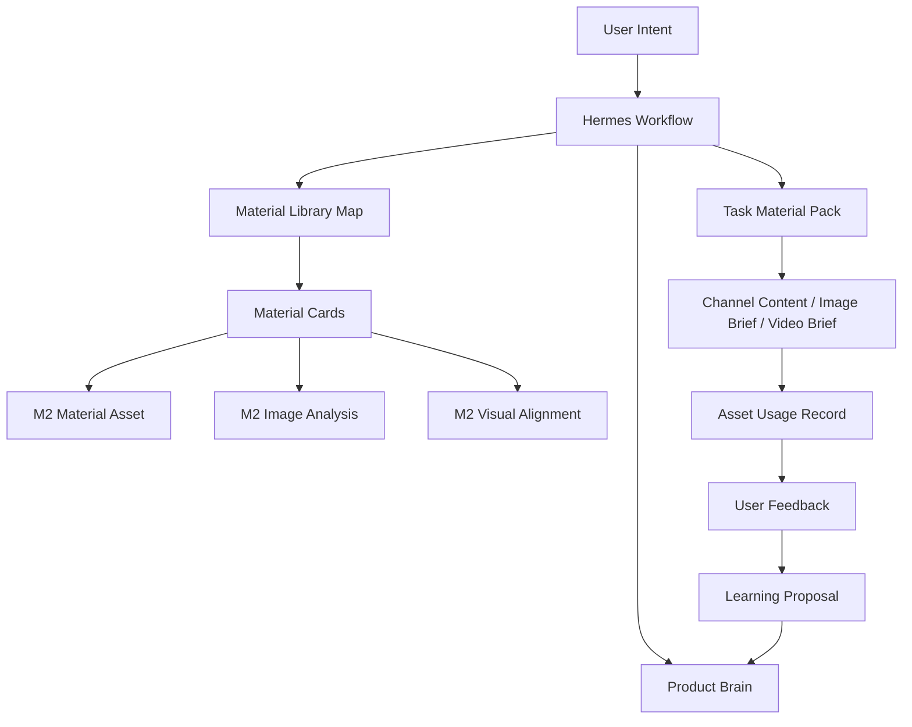

# M3 Asset Library and File-Reading Architecture

状态：M3.1-M3.8 已落地并通过本地验证  
修订日期：2026-07-07  
适用范围：`product_creative` 插件 M3 大版本开发  

本文档用于固定 M3 的开发方向。M3 开发开始前，必须先确认本文档；后续 M3.x 小版本开发和验收都应对齐本文档。

当前实现摘要：

```text
已新增 material_cards.py / material_packs.py。
已新增 CLI / Hermes tools：material-compat、material-card-rebuild、material-library-map、task-material-pack、material-usage、material-feedback。
已接入 generate / brief / video-intent / video-brief / workflow。
已新增 verify_m3_asset_library_loop.ps1 综合验收脚本。
默认验证不调用外部模型，live_call_count = 0。
M3 素材反馈只形成可学习证据，不直接写入 Product Brain。
```

本次修订结论：

```text
M3 不以复杂语义检索或向量数据库为主线。
M3 主线改为：文件系统素材库 + M2 图片理解产物 + Hermes 可读素材卡片 + 任务素材包 + 轻量选择。
```

---

## 1. M3 的核心判断

M2 已经完成了图片进入系统、图片被理解、图片与 Product Brain 安全对齐的关键基础。

M3 不应重新发明素材系统，也不应提前建设复杂向量检索系统。M3 应把 M2 已经生成的图片理解产物整理成 Hermes 可以稳定读取和判断的文件结构。

M2 和 M3 的关系：

```text
M2 = 图片进入系统、被多模态理解、被 visual-align 安全检查。
M3 = 让 Hermes 在生成任务前读取这些图片理解文件，并自己挑选素材。
```

一句话：

```text
M3 的目标不是让素材库更复杂，而是让 Hermes 更会读取当前产品已有素材。
```

---

## 2. 为什么修订 M3 方案

### 2.1 原方案的问题

原 M3 方案中出现了 `asset_profile`、`asset_search`、`asset_recommend`、`semantic score`、`vector-ready` 等概念。它们本身不是错误，但如果作为 M3 的主线，会有过早工程化的风险。

当前阶段真正需要解决的不是：

```text
如何建设一个完整素材检索系统？
如何做向量数据库？
如何做大规模语义搜索？
```

而是：

```text
Hermes 如何知道素材在哪？
Hermes 如何读取 M2 已经生成的图片文字理解？
Hermes 如何判断哪张图适合本次文案 / 主图 brief / 视频分镜？
Hermes 如何在不污染 Product Brain 的情况下记住素材使用反馈？
```

### 2.2 修订后的原则

M3 采用最小可用架构：

```text
素材文件仍保存在 assets/。
M2 图片理解仍保存在 artifacts/image_analysis/。
M2 视觉对齐仍保存在 artifacts/visual_alignments/。
M3 新增 material card，把这些信息聚合成 Hermes 容易读取的 Markdown / JSON。
M3 新增 task material pack，让 Hermes 针对一次任务只读少量相关素材卡片。
```

不做重型系统：

```text
不接向量数据库。
不做跨产品全局素材搜索。
不做外部素材自动抓取。
不做复杂 DAM 平台。
不默认调用真实外部模型。
```

---

## 3. M3 的产品目标

M3 的产品目标：

```text
让用户不必每次手动指定素材。
让 Hermes 能读取当前产品素材库和 M2 图片理解结果。
让文案、图片 brief、视频分镜能基于已有素材生成。
让素材使用反馈成为后续选择素材的依据。
```

用户视角变化：

```text
M2 用户常说：
“用这张主图生成今天的视频。”

M3 用户应可以说：
“帮周十五蜂蜜露生成今天的视频。”

Hermes 应自动：
1. 读取 Product Brain。
2. 读取当前产品的 material library。
3. 读取 material cards。
4. 读取相关 image_analysis / visual_alignment 摘要。
5. 选择适合本次任务的素材。
6. 生成视频 brief / 图片 brief / 渠道内容。
7. 说明用了哪些素材，为什么用。
```

---

## 4. M3 与 M2 的衔接

M3 必须直接复用 M2 的产物。

### 4.1 M2 已有产物

M2 已有：

```text
artifacts/material_assets/*.json
artifacts/material_assets/*.md

artifacts/image_analysis/*.json
artifacts/image_analysis/*.md

artifacts/visual_alignments/*.json
artifacts/visual_alignments/*.md

structured/material_assets_index.jsonl
structured/image_analysis_index.jsonl
structured/visual_alignment_index.jsonl
structured/material_library.json

Product State: assets.materials
```

M3 不复制这些产物的职责，只做聚合与读取指引。

### 4.2 衔接方式

```text
M2 material_asset
-> M3 material card 的基础文件、role、usage、media、remote URL。

M2 image_analysis
-> M3 material card 的图片文字理解、视觉摘要、风险、置信度。

M2 visual_alignment
-> M3 material card 的产品适配性、安全状态、是否可作为主参考。

M2 video_intent / video_brief
-> M3 后不再只默认选最新素材，而是读取 task material pack。
```

### 4.3 不变的安全边界

```text
image_analysis 不直接改 Product Brain。
visual_alignment 不直接改 Product Brain。
material card 不直接改 Product Brain。
task material pack 不直接改 Product Brain。
素材反馈如需形成长期学习，仍必须走 proposal / apply。
```

---

## 5. M3 范围

### 5.1 M3 必须做

```text
Material Card 数据契约
Material Card Markdown 文件
Material Library Map 总览文件
Task Material Pack
文件读取式素材选择
生成链路读取素材卡片
素材使用记录
素材反馈记录
M4 入口检查
```

### 5.2 M3 不做

```text
不做向量数据库。
不做复杂 embedding provider。
不做跨产品素材搜索。
不做外部素材自动抓取。
不做真实视频生成能力扩展。
不做生图 provider 大规模扩展。
不做 Web UI 素材管理台。
不让素材分析绕过人工确认写入 Product Brain。
```

### 5.3 未来什么时候再考虑向量检索

只有出现以下情况，才重新评估向量检索：

```text
单个产品素材超过 200 个。
需要跨产品复用素材。
需要检索大量外部竞品/热点素材。
文件卡片读取导致上下文明显膨胀。
简单关键词和 role/usage 已无法满足素材选择。
```

在此之前，M3 坚持文件读取方案。

---

## 6. 用户参与设计

M3 应减少用户参与。

### 6.1 用户仍然需要参与

```text
首次提供素材。
确认素材使用权或 remote URL 可被外部模型访问。
在素材缺失时上传或指定素材。
在素材存在风险时确认是否只作为风格参考。
对生成结果或素材选择结果给反馈。
确认是否把素材偏好写入 Product Brain。
```

### 6.2 用户不应该参与

```text
不应该每次手动指定 material_id。
不应该阅读 JSON 才知道用了哪张图。
不应该每次解释哪张图是主图。
不应该手动判断素材能否做视频首帧。
不应该为低风险的卡片重建、文件索引、任务素材包反复确认。
```

### 6.3 M3 理想体验

```text
用户：帮这个产品做一条今天的抖音视频。

Hermes：
我会读取 Product Brain 和素材卡片。
当前可用主图：material-001，已通过 visual-align，可作为产品身份参考。
当前可用风格图：material-003，可作为氛围参考，但不作为产品事实来源。
我会基于这两张素材生成视频 brief。
不会调用真实视频模型，也不会修改 Product Brain。
```

---

## 7. 系统架构

### 7.1 架构位置



### 7.2 新增模块

```text
material_cards.py
负责读取 M2 material_assets / image_analysis / visual_alignments，生成 Hermes 可读素材卡片。

material_packs.py
负责根据任务生成 task material pack，只放本次任务需要读的少量素材卡片。

workflow.py
增加 rebuild_material_cards / prepare_task_material_pack 等 action。

briefs.py / video_intent.py / video_briefing.py
接入 task material pack，不再只依赖手动 asset 或最新素材。
```

### 7.3 继续复用模块

```text
materials.py
继续负责素材注册、remote URL 绑定、image-analyze、visual-align。

artifacts.py
继续负责 artifact manifest。

store.py
继续负责产品工作区目录初始化。
```

---

## 8. 数据与文件设计

### 8.1 Material Card JSON

每个素材生成一个 JSON 卡片：

```json
{
  "schema_version": "product_creative.material_card.v3",
  "material_card_id": "material-card-xxx",
  "material_id": "material-xxx",
  "product_id": "demo-product",
  "status": "active",
  "role": "current_main_image",
  "usage": ["product_reference", "video_first_frame"],
  "source_files": {
    "material_asset": "artifacts/material_assets/material-xxx.json",
    "image_analysis": "artifacts/image_analysis/image-analysis-xxx.json",
    "visual_alignment": "artifacts/visual_alignments/visual-align-xxx.json"
  },
  "image_file": "assets/images/current_main_image/xxx.png",
  "remote_url": "",
  "media": {
    "kind": "image",
    "orientation": "square",
    "width": 1024,
    "height": 1024,
    "mime_type": "image/png"
  },
  "ai_readable_summary": {
    "manual_description": "当前产品主图",
    "visual_summary": "图片主体清晰，可作为产品视觉参考。",
    "style_tags": ["清爽", "电商主图"],
    "visible_text": [],
    "risk_flags": ["mock analysis only"]
  },
  "readiness": {
    "can_reference_image": true,
    "can_video_first_frame": true,
    "has_image_analysis": true,
    "has_visual_alignment": true,
    "visual_alignment_status": "ready_for_proposal",
    "blocked_as_primary_reference": false,
    "has_remote_url": false
  },
  "brain_write_policy": {
    "direct_write_to_product_brain": false,
    "requires_human_confirmation_for_learning": true
  }
}
```

### 8.2 Material Card Markdown

每个素材同时生成 Markdown，供 Hermes 直接读取：

```text
# Material Card: material-xxx

Role: current_main_image
Usage: product_reference, video_first_frame
Image file: assets/images/current_main_image/xxx.png
Remote URL: none

## AI-readable Summary

这是一张当前产品主图。主体清晰，可作为产品身份参考。

## Visual Understanding

来源：artifacts/image_analysis/image-analysis-xxx.md
置信度：low / medium / high
摘要：...

## Product Alignment

来源：artifacts/visual_alignments/visual-align-xxx.md
状态：ready_for_proposal / blocked
可作为主参考：true / false

## Recommended Use

- image_brief: suitable
- video_first_frame: suitable
- style_reference: possible

## Warnings

- mock analysis only
- do not infer packaging claims without human confirmation
```

### 8.3 Material Library Map

产品级总览：

```text
structured/material_library_map.json
artifacts/material_library/material_library.md
```

作用：

```text
告诉 Hermes 当前产品有哪些素材卡片。
按 role / usage / readiness 分组。
避免 Hermes 每次扫描整个素材文件夹。
```

### 8.4 Task Material Pack

每次生成任务前，生成一个任务素材包：

```text
artifacts/task_material_packs/<pack-id>.json
artifacts/task_material_packs/<pack-id>.md
```

任务素材包只包含本次任务需要读取的少量素材：

```text
任务：douyin_video_brief
推荐主参考：material-001
推荐风格参考：material-003
不推荐素材：material-004，原因：visual-align blocked
缺失项：remote_url missing for live video provider
```

---

## 9. Hermes 文件读取策略

M3 不是让 Hermes 盲目扫描文件夹，而是给 Hermes 一条稳定读取路径：

```text
1. Product Brain
2. Material Library Map
3. Task Material Pack
4. Selected Material Cards
5. 必要时读取对应 image_analysis.md / visual_alignment.md
```

这样既保留 AI 自主判断，又避免上下文爆炸。

### 9.1 选择逻辑

M3 采用轻量选择逻辑：

```text
先按任务筛 role / usage。
再看 readiness。
再排除 blocked 或高风险素材。
再读取素材卡片文本摘要。
最后由 Hermes 根据任务目标和 Product Brain 做判断。
```

这不是复杂检索系统，而是“给 AI 准备正确文件”。

### 9.2 缺失处理

```text
没有素材：要求用户上传。
有素材但没有 image_analysis：推荐 image-analyze。
有 image_analysis 但没有 visual-align：推荐 visual-align。
素材适合 brief 但缺 remote_url：允许生成 brief，但不能直接 live provider payload。
素材 visual-align blocked：不能作为主参考，只能作为风险项显示。
```

---

## 10. Workflow 设计

M3 新增或增强 workflow action：

```text
rebuild_material_cards
prepare_task_material_pack
record_material_feedback
```

说明：`record_material_usage` 是生成链路内部自动记录，不作为需要用户主动执行的 workflow action。

### 10.1 用户生成视频

用户说：

```text
帮这个产品生成今天的抖音视频。
```

M3 workflow：

```text
resolve_video_intent
-> rebuild_material_cards（如卡片缺失或过期）
-> prepare_task_material_pack(task=video_brief, channel=douyin)
-> 如果缺素材，停下要求用户上传
-> 如果缺 image_analysis，推荐 analyze_material_image
-> 如果缺 visual_alignment，推荐 align_visual_analysis
-> create_video_brief
-> review_video_brief
-> record_material_usage
-> 在真实视频提交前停下
```

### 10.2 用户生成图片 brief

用户说：

```text
帮这个产品做一版电商主图方案。
```

M3 workflow：

```text
rebuild_material_cards
-> prepare_task_material_pack(task=image_brief, channel=ecommerce)
-> export image brief with selected material cards
-> record_material_usage
```

### 10.3 用户生成渠道文案

用户说：

```text
帮这个产品写一篇小红书种草文案。
```

M3 workflow：

```text
prepare_task_material_pack(task=channel_content, channel=xiaohongshu-seeding-note)
-> generate channel content with material summary
-> channel evaluate / review
-> record_material_usage
```

---

## 11. M3 小版本路线

### M3.0 架构修订与确认

目标：确认 M3 采用文件读取方案，而不是重型语义检索 / 向量数据库方案。

开发范围：

```text
修订 M3 架构文档。
修订主线路线图。
明确 M2 冻结，M3 从 M2 产物上继续。
```

验收：

```text
用户确认本文档后，才能开始 M3.1。
```

### M3.1 M2 素材产物兼容层

目标：完整读取 M2 已有的 material_assets、image_analysis、visual_alignments。

开发范围：

```text
新增内部读取函数。
能按 material_id 找到对应 material_asset。
能找到最新 image_analysis。
能找到最新 visual_alignment。
能识别缺失、过期、blocked、mock analysis 等状态。
```

用户价值：

```text
M3 不重做图片理解，直接继承 M2 的图片理解成果。
```

验收：

```text
对一个已有 M2 产品运行检查，能列出每个 material 的分析和对齐状态。
不生成新模型调用。
不修改 Product Brain。
```

### M3.2 Material Card 生成

目标：把 M2 产物聚合成 Hermes 可读的素材卡片。

开发范围：

```text
新增 material_cards.py。
新增 material-card-rebuild 命令和 tool。
输出 artifacts/material_cards/*.json。
输出 artifacts/material_cards/*.md。
输出 structured/material_card_index.jsonl。
```

用户价值：

```text
Hermes 不用在多个 M2 artifact 之间来回拼信息，可以直接读取一张素材卡片。
```

验收：

```text
每个 active material 生成一张卡片。
卡片包含图片路径、role、usage、视觉摘要、对齐状态、推荐用途和风险。
卡片引用原始 M2 artifact 路径。
```

### M3.3 Material Library Map

目标：生成产品级素材总览，告诉 Hermes 当前产品有哪些素材卡片。

开发范围：

```text
新增 material-library-map 命令和 tool。
输出 structured/material_library_map.json。
输出 artifacts/material_library/material-library-map.json。
输出 artifacts/material_library/material_library.md。
按 role、usage、readiness 分组。
```

用户价值：

```text
Hermes 不需要扫描所有文件夹，先看总览，再按需读取素材卡片。
```

验收：

```text
能列出 current_main_image、product_photo、style_reference 等分组。
能标明哪些素材可做主参考，哪些 blocked，哪些缺 image_analysis / visual_alignment。
```

### M3.4 Task Material Pack

目标：针对一次生成任务，准备少量相关素材文件给 Hermes 读取。

开发范围：

```text
新增 task-material-pack 命令和 tool。
支持 task：channel_content、image_brief、video_brief、provider_payload。
根据 role / usage / readiness 生成候选素材包。
输出 artifacts/task_material_packs/*.json / *.md。
```

用户价值：

```text
用户不需要手动挑素材；Hermes 每次只读取本次任务相关素材。
```

验收：

```text
video_brief pack 能优先选择 video_first_frame / current_main_image。
image_brief pack 能优先选择 current_main_image / product_photo。
channel_content pack 能提供可描述产品图或风格图摘要。
缺素材时明确返回 missing_requirements。
```

### M3.5 生成链路集成

目标：让 image brief、video brief、channel content 读取 task material pack。

开发范围：

```text
briefs.py 接入 task material pack。
video_intent.py 不再只默认选最新素材。
video_briefing.py 记录 task_material_pack_id 和 material_id。
channel content context 可包含素材卡片摘要。
workflow-next / workflow-run 可自动执行低风险 pack 准备。
```

用户价值：

```text
用户只说生成目标，Hermes 自动读取素材卡片并使用合适素材。
```

验收：

```text
不手动传 asset，也能生成带素材引用的 image brief。
不手动传 asset，也能生成带素材引用的 video brief。
生成 artifact 可追溯 task_material_pack_id 和 material_id。
```

### M3.6 素材使用记录

目标：记录每次生成到底使用了哪些素材。

开发范围：

```text
新增 material_usage record。
生成 artifact 记录 used_material_ids / material_card_ids / task_material_pack_id。
输出 structured/material_usage_index.jsonl。
```

用户价值：

```text
系统能知道某张图被用于哪些内容和任务，为后续自迭代做准备。
```

验收：

```text
image brief / video brief / channel content 都能记录素材使用。
usage record 不修改 Product Brain。
```

### M3.7 素材反馈与轻量偏好

目标：用户可以反馈“这张素材选得好不好”，并影响后续选择。

开发范围：

```text
新增 material-feedback 命令和 tool。
支持 selected / rejected / note / task / channel。
反馈进入 structured/material_feedback.jsonl。
下一轮 task material pack 可读取反馈作为轻量排序信号。
如需长期学习，生成 proposal，人工确认后写入 Product Brain。
```

用户价值：

```text
系统开始知道哪些素材更适合当前产品的哪些任务。
```

验收：

```text
正反馈素材在同类任务中优先级上升。
负反馈素材在同类任务中降权或附带 warning。
不直接修改 Product Brain。
```

### M3.8 M3 验收与 M4 入口检查

目标：验证 M3 已经完成“文件读取式素材选择”能力，判断是否能进入 M4。

开发范围：

```text
新增 verify_m3_asset_library_loop.ps1。
执行 M2 关键回归。
更新路线图。
```

验收：

```text
从新产品开始，注册多张素材。
运行 M2 image-analyze / visual-align。
M3 生成 material cards。
M3 生成 material library map。
M3 生成 task material pack。
不手动传 asset，生成 image brief。
不手动传 asset，生成 video brief。
记录素材反馈后，下一轮 pack 排序变化。
默认 live_call_count = 0。
不直接修改 Product Brain。
```

当前已通过验证：

```powershell
powershell -NoProfile -ExecutionPolicy Bypass -File .\.hermes\plugins\product_creative\scripts\verify_m3_asset_library_loop.ps1
powershell -NoProfile -ExecutionPolicy Bypass -File .\.hermes\plugins\product_creative\scripts\verify_m2_visual_materials.ps1
powershell -NoProfile -ExecutionPolicy Bypass -File .\.hermes\plugins\product_creative\scripts\verify_m2_visual_alignment.ps1
powershell -NoProfile -ExecutionPolicy Bypass -File .\.hermes\plugins\product_creative\scripts\verify_m2_video_intent.ps1
powershell -NoProfile -ExecutionPolicy Bypass -File .\.hermes\plugins\product_creative\scripts\verify_m2_workflow_run.ps1
```

---

## 12. 进入 M4 的条件

满足以下硬性条件，才允许进入 M4：

```text
1. M3.1-M3.8 全部完成并通过验证。
2. M3 能完整读取 M2 material_assets / image_analysis / visual_alignments。
3. 每个 active material 都能生成 Hermes 可读的 material card。
4. Material Library Map 能让 Hermes 快速知道素材库状态。
5. Task Material Pack 能为 image brief / video brief / channel content 准备少量相关素材。
6. 不手动传 asset 的情况下，image brief 能引用 task material pack。
7. 不手动传 asset 的情况下，video brief 能引用 task material pack。
8. 素材使用记录和反馈能影响下一轮 task material pack。
9. 默认验证不调用真实外部模型。
10. Product Brain 高影响写入仍有人工确认门禁。
```

禁止进入 M4 的情况：

```text
生成仍主要依赖用户手动指定 material_id。
Hermes 仍只能默认选择最新素材。
material card 不能追溯 M2 image_analysis / visual_alignment。
blocked 素材能被当成主参考。
真实外部模型调用默认发生且没有确认门禁。
素材反馈直接写入 Product Brain。
```

---

## 13. M3 完成后的用户体验

M3 完成后，用户体验应变为：

```text
用户：帮周十五蜂蜜露做一条今天抖音视频。

Hermes：
我会读取 Product Brain 和素材库。
当前可用主图 material-001 已有图片理解和 visual-align，可作为首帧参考。
material-003 是风格参考，可用于氛围描述，但不作为产品事实来源。
我会基于这些素材生成视频 brief。
本次不会调用真实视频模型，也不会修改 Product Brain。
```

如果素材不足：

```text
Hermes：
当前产品没有可用主图或视频首帧素材。
请上传一张产品主图。
上传后我会先注册素材，再生成图片理解和素材卡片。
```

如果素材存在风险：

```text
Hermes：
这张图的 visual-align 状态为 blocked。
我不会把它作为主参考。
你可以重新上传素材，或明确说明只把它作为风格参考。
```

---

## 14. 对最终目标的贡献

M3 修订后对最终目标的贡献：

```text
产品长期认知继续由 Product Brain 管理。
产品素材理解继续复用 M2 的多模态分析结果。
Hermes 能通过文件读取方式理解已有素材。
生成前不再只靠用户手动指定素材。
素材使用反馈能进入后续选择逻辑。
不引入当前阶段不必要的复杂向量数据库。
```

最终一句话：

```text
M3 是 M2 图片理解能力的使用层，不是一个重型素材检索平台。
```
