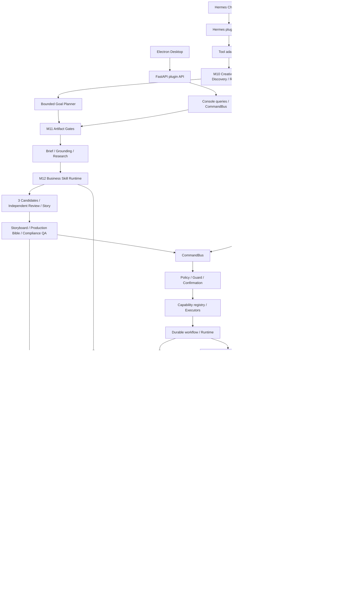

# Architecture Current

- 日期：2026-07-17
- 状态：as-is recovery；不是未来设计
- M9.1 实现基线：`83b4e8f`
- 重建分支：`product-creative-rebaseline-20260716`
- M11–M15 实现与测试提交：`25e26df`；当前 HEAD 进入项目时重新查询
- M14 自动媒体 QA、返修与学习质量已在 worktree 完成本地 Gate，状态为
  `DONE_IN_PILOT_REF_UNPUBLISHED_LIVE_GATE_AND_USER_ACCEPTANCE_PENDING`

目标架构、专业创意工作流和从当前状态到 Final 1.0 的路线以 `docs/PRODUCT_AGENT_DIRECTION.md` 为准。本文只描述当前代码事实。

## 当前架构

## 技术栈与目录

- Python 3.11–3.13、Pydantic、FastAPI/Starlette；SQLite + workspace 文件系统。
- Electron、React、TypeScript、Vite/Vitest；exact-main-video 依赖 Pillow/ffmpeg。
- `capabilities/`：领域能力；`application/`：CommandBus/policy；`runtime/`/`durable_workflow/`：状态机；`contracts/`/`ports/`：边界；`infrastructure/sqlite/`：durable state；`dashboard/plugin_api.py`：HTTP API。
- M0–M8 历史文档和阶段脚本位于 `docs/history/product-creative-legacy/`，不再进入插件分发包。

## 源码与拆仓状态

- 当前采用方案 1：`.hermes/plugins/product_creative/` 是唯一业务源码真源。
- 独立 `hermes-product-creative` 仓库是发布流程生成的分发仓库，不接受双向业务修改。
- Product Creative 公开契约、独立安装和兼容矩阵稳定后，再通过专门里程碑拆分源码。
- 原 `product-creative-runtime` 脏 worktree 是恢复证据；当前开发只在 `product-creative-rebaseline-20260716` 进行。

## 核心调用链

`plugin.yaml` tool → `product_workflow_run` → Creative Task/Readiness → bounded Goal Planner
→ M11 professional artifact gates → M12 controlled Business Skill Runtime → Story/Production
Bible/Preflight QA → M13 Dependency/Plate/Shot Plan → task authorization → Provider shot 或
local fixture → deterministic compositor → shot results/manifest/media result → M14 technical/
text/packaging/story QA → PASS、局部返修、人工审阅或拒绝 → review/feedback。
反馈形成 revision/proposal，确认后才生成新 Brain 版本。

## M10 产品认知与自主创作

- `runtime/creative_tasks.py`：可恢复 Creative Task、计划推进、研究恢复、Mock/Live provider 提交与视频状态轮询、反馈 revision/learning。
- `brain/discovery.py`：按任务计算 Product Readiness、问题排序、字段 evidence/proposal；不直接写 Canonical Brain。
- `runtime/authorization.py`：数据源/Cookie/图片/视频次数和有效期；不包含 Brain 写回。
- `application/planner.py`：从现有 capability registry 生成最多 24 步的跨域计划。
- `dashboard/plugin_api.py` + plugin-owned UI：只读 task 查询和五视图展示。

## M11 专业创作工件层

- `contracts/creative_artifacts.py`：8 类冻结、拒绝额外字段、SHA-256 防篡改工件。
- `runtime/professional_artifacts.py`：工件持久化、加载、版本修订和 Grounding/Research 生成。
- `runtime/creative_direction.py`：Stable/Variation/Exploration、Decision、Story、Production Bible 和 Preflight QA。
- `runtime/creative_tasks.py`：视频步骤进入 Provider/本地 composer 前验证完整工件和 QA；任务修订生成 `-rN`，不覆盖原包。
- `provider_payloads.py`：由 Production Bible 逐镜头编译视频请求，记录源工件 ID/hash。
- `exact_video_service.py`：M11 任务传入 Story/Bible，避免使用通用故事 fallback。
- `console_queries.py`/`desktop_ui/index.js`：Desktop 展示工件摘要和完整审阅内容。

## M12 专业业务 Skill Runtime

- `runtime/business_skills.py`：八个 Skill 的 Catalog、契约校验、Hermes
  `complete_structured` 适配、fixture executor 和 fail-closed 行为。
- `skills/*/SKILL.md` + `contract.json`：任务导演、研究导演、创意策略、独立评审、编剧、分镜导演、卡审和学习分析的版本化方法。
- `contracts/creative_artifacts.py`：`product_creative.skill_execution.v1`，保存输入/输出哈希、版本、允许工具、实际动作、模式和失败诊断。
- `runtime/professional_artifacts.py`：Skill execution 与来源专属 Research Insight 的 workspace 持久化。
- `runtime/creative_direction.py`：由 Skill 生成 Candidates、Decision、Story、Storyboard 和语义卡审；由确定性代码编译产品出现时间、五镜头边界、immutable product plate、字幕后期和包装硬规则。
- 历史相似度比较 hook、conflict、progression、product role 和 ending；高相似且无 novelty strategy 时进入修订。
- `learning/result_evaluation_service.py` 读取版本化 `learning-analyst` 方法，但长期写回继续走 proposal + confirmation。

生产环境没有 Skill executor 时任务 fail closed，不回退成固定专业剧情。测试 fixture 只提供离线结构化输出，仍经过相同 Schema、artifact、Gate 和持久化路径。

当前质量边界：M12 证明专业方法被选择、执行和审查；M13 证明可恢复逐镜头媒体生产；
M14 已实现生成后 QA、局部返修和人工质量决定。真实 VLM/Provider 的判断稳定性仍需
Live Gate，fixture 不等于可发布质量证明。

## M13 Reliable Media Production

- `runtime/media_dependencies.py`：发现 ffmpeg/ffprobe，诊断 H.264、AAC、Pillow、中文
  字体、磁盘、素材、Bible 和 Provider readiness。
- `runtime/product_plate.py`：从当前确认素材建立不可变 Product Plate，支持 alpha、
  边缘连通背景和 full-rect 安全降级。
- `runtime/media_plan.py`：把 Production Bible 编译为有顺序、预算、素材角色和幂等键
  的 Shot Graph；Provider prompt 禁止产品包装和可读文字。
- `provider_shots.py`：扩展现有 Provider Gateway 的单镜头边界；不传 plate/字幕，
  `local-fixture` 产生真实背景 PNG。
- `runtime/media_compositor.py`：把背景、plate 和 ASS 字幕合成为标准 H.264/AAC 镜头，
  再按计划顺序输出 faststart MP4。
- `runtime/media_production.py`：prepare、execute、resume；跳过已完成镜头，只重试失败
  镜头，并保存 Composite Manifest 和兼容 media result。
- `runtime/creative_tasks.py`：在授权前准备 M13 工件，在任务授权后执行；preview-first
  选择方向不会自动进入付费边界。

M13 复用现有 artifact repository、Creative Task、authorization、Provider Gateway、
review/feedback 和 workspace 隔离。没有新增公共工具、任务数据库或 Hermes core 路由。

当前离线 E2E 已产生可播放多镜头 MP4 并通过 ffprobe；真实异步豆包/Seedance shot 的
真实异步 Provider shot 的重启恢复仍是 Live Gate。

## M14 Automatic Media QA, Repair, and Learning Quality

- `runtime/media_technical_qa.py`：本地检查 hash、编码、画布、帧率、时长、faststart、
  镜头顺序、黑帧、冻结、静音和削波。
- `runtime/media_text_qa.py`：校验 ASS 源、乱码、安全区、显示时长和可替换 OCR 观察；
  adapter 不可用时返回 UNKNOWN。
- `runtime/packaging_visual_qa.py`：校验 Product Plate hash/provenance，并对 plate 不透明
  区域抽帧比较；evidence 只能写当前 workspace。
- `runtime/story_continuity_qa.py`：校验 Bible/Plan/Manifest 覆盖、钩子/转折/结尾和
  可替换视觉连续性观察。
- `runtime/media_qa.py`：聚合不可变 QA Report；确定性 critical failure 优先于模型判断。
- `runtime/media_repair.py`：把失败映射为字幕重渲染、plate 重合成、最终重合成或背景
  Provider 重生成；保留成功镜头，最多自动两轮。
- `runtime/media_review.py`：确认后记录 approve、accept_with_warning 或 reject，不修改
  原 QA Report，并形成 receipt/audit/learning evidence。
- `runtime/media_production.py`：M13 合成后立即执行 QA；修复后完整复检。
- `runtime/creative_tasks.py`：从自然语言“继续修复这个视频”恢复最后 Repair Decision。

M14 没有新增公共 Hermes tool、数据库或宿主专属路由，继续复用 artifact repository、
Creative Task、authorization、Command Bus、M9 confirmation/audit 和 learning service。

认知层为 Evidence Inbox → Draft Understanding → Canonical Product Brain，Task Context 与三者分离。外部 snapshot 标记 `not_product_fact`；字段/学习 proposal 经确认后才创建新 Brain 版本。

## Desktop 当前状态

- 通用 `desktop-plugins/` 宿主 + 插件 `desktop_ui/index.js` bundle 是当前实现；Product Creative 业务页面归插件所有。
- M11 在现有五视图内增加 Grounding、Artifact Gates、Candidates/Decision/Story/QA 和
  Production Bible；M12 增加 Skill provenance；M13 增加依赖状态、镜头进度、Product
  Plate、Shot outputs 和 Composite Manifest；M14 增加自动 QA、失败证据、Repair
  Decision、人工决定和 learning evidence，不新增宿主专属路由。
- M15 将同一 plugin-owned 页面扩展为六视图引导工作台：无产品 onboarding、Overview
  自然语言任务、Tasks 无 ID 恢复、Review 三节点和 Settings 安全诊断。
- `POST /v1/products` 只复用 workspace resolve/ingest；产品描述进入 Evidence/Draft，
  不自动改变 Canonical Brain。`GET /v1/diagnostics` 只检查凭据存在性、媒体工具和固定
  loopback Sidecar，不返回密钥、不调用 Provider。
- M15 临时分发已通过定向 UI/API、版本/哈希/敏感扫描和 enabled user-plugin 离线安装；
  现有 Hermes Desktop Electron/NSIS 管线已生成 Desktop 壳。该薄安装器首次启动按 install
  stamp 获取 runtime；包含 M15 的 origin pilot ref 已可获取，但旧构建 stamp 仍指向 `0aa9563`，
  因此需要重建并做 fresh-install 后才是可复现 M15 安装形态。
- 本地隔离试运行通过显式 worktree root 和 enabled user plugin 证明打包壳与当前 runtime
  可组合运行；这不是干净机器安装证据。

## 外部边界

- Hermes LLM runtime 注入，失败可 deterministic fallback。
- real provider 要求开关、凭据、readiness、确认。
- M10 live provider 还要求 task-bound authorization；默认开关关闭。异步视频提交消耗一次额度，后续状态恢复不重复计费。
- XHS/Douyin sidecar 不在仓库；无专属 MCP、向量库、外部消息队列或 cron。

## 限制与技术债

- capability registry 中央聚合；`tools.py`/`tool_handlers.py` 和新旧 provider/facade 表面并存。
- 64 个 PowerShell 集成脚本，无统一 coverage。
- project plugin 继续被 Desktop 可执行页面和 backend API discovery 排除；生产页面只接受 enabled bundled/user plugin。
- Desktop Plugin SDK v1 把 enabled bundled/user plugin 视为受信任的同源代码。workspace header 仍由 renderer 提供，不是对恶意 enabled plugin 的安全隔离；若未来支持不受信任插件，必须把 workspace 绑定下沉到 main/backend。
- media descriptor 是本地绝对路径，当前验收仅覆盖 local Desktop；remote Desktop 媒体预览仍是已知限制。
- 全量宿主 UI 套件存在与 M9.1 无关的既有失败；M9.1 定向用例、typecheck、build 均通过。
- export 已包含未提交但未忽略的第一方源码，并通过临时离线安装；dirty build 仍不能
  被误称为正式发布包。
- Desktop 薄安装器必须让 install stamp 指向可获取 ref。方案 A 已提供 origin pilot ref；
  新 stamp/fresh-install 与 operator Gate 仍须验证。
- 当前媒体工具借用本机 AIMIXMaster 内置 ffmpeg/ffprobe，正式 Desktop 尚未捆绑。
- Windows 深层测试路径可能触发 legacy `MAX_PATH`。
- 真实异步 Provider shot 恢复和真实 VLM/OCR 视觉 QA 尚未完成联合 Live Gate。
- executor 调用失败可写失败 Skill execution；executor 返回后发生的部分业务 Schema 校验失败目前只会阻断正式工件，并非全部都有独立失败 execution artifact。
- Windows PowerShell 5 标准输入代码页可能损坏中文 fixture；测试/审阅脚本需使用 UTF-8 文件或 Unicode 转义。

旧 Roadmap/M4 Desktop 和 JSON/JSONL durable state 描述已过时。当前 SQLite 是
workflow/event/receipt/provider durable 真源；workspace 文件保存 Creative Task、
专业创作工件、Skill execution、M13 媒体工件、可审阅 artifact 和兼容输出。
M11–M15 已进入 origin pilot ref；当前门禁是 M15 新 stamp fresh-install 与内部运营全链试用，
并独立保留动态 M13.1/M14.1 联合真实 Live Gate 和用户验收。

## M13.1 dynamic exact-main route

视频 Provider 不再因为 exact packaging 自动降级为图片 Provider。每个视频 shot 携带
`motion_required`、`motion_description`、`maximum_freeze_ratio` 和
`product_plate_motion`。Seedance 只接收产品外的场景、人物和动作 Prompt；4–15 秒
Provider 时长与最终故事时长分离，下载后由 compositor 裁剪。

Product Plate 只允许 0.30 秒竖直入场和既有统一缩放/平移/alpha composite，之后固定在
包装 QA 使用的确定性位置。技术 QA 将持续到 EOF 的 freeze interval 计入冻结比例；Story
QA 通过 VLM 的 `observed_action/action_completed` 逐镜判断动作完成度。普通 Web 为默认
实时来源，XHS/Douyin 仅是授权后的可选 Research Adapter。
