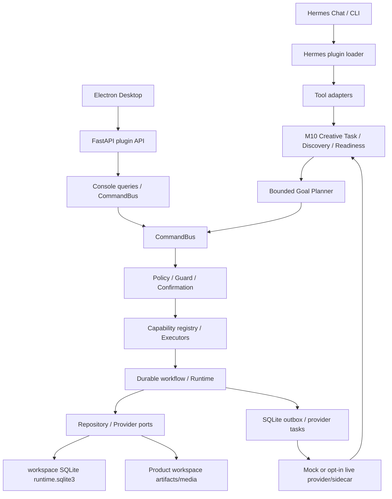

# Architecture Current

- 日期：2026-07-15
- 状态：as-is recovery；不是未来设计
- M9.1 实现基线：`83b4e8f`
- M10 工作区基线 HEAD：`8ba592cdca0e835580771795cafea424e3618e0d`（实现未提交）

## 当前架构

## 技术栈与目录

- Python 3.11–3.13、Pydantic、FastAPI/Starlette；SQLite + workspace 文件系统。
- Electron、React、TypeScript、Vite/Vitest；exact-main-video 依赖 Pillow/ffmpeg。
- `capabilities/`：领域能力；`application/`：CommandBus/policy；`runtime/`/`durable_workflow/`：状态机；`contracts/`/`ports/`：边界；`infrastructure/sqlite/`：durable state；`dashboard/plugin_api.py`：HTTP API。

## 核心调用链

`plugin.yaml` tool → `product_workflow_run` → Creative Task/Readiness → bounded Goal Planner → capability registry → `CommandBus` → policy/guard/confirmation → executor → repository/provider → SQLite event/receipt/outbox/task/learning + workspace artifact。反馈形成 proposal，确认后生成新 Brain 版本。

## M10 产品认知与自主创作

- `runtime/creative_tasks.py`：可恢复 Creative Task、计划推进、研究恢复、Mock/Live provider 提交与视频状态轮询、反馈 revision/learning。
- `brain/discovery.py`：按任务计算 Product Readiness、问题排序、字段 evidence/proposal；不直接写 Canonical Brain。
- `runtime/authorization.py`：数据源/Cookie/图片/视频次数和有效期；不包含 Brain 写回。
- `application/planner.py`：从现有 capability registry 生成最多 24 步的跨域计划。
- `dashboard/plugin_api.py` + plugin-owned UI：只读 task 查询和五视图展示。

认知层为 Evidence Inbox → Draft Understanding → Canonical Product Brain，Task Context 与三者分离。外部 snapshot 标记 `not_product_fact`；字段/学习 proposal 经确认后才创建新 Brain 版本。

## Desktop 两种状态

- **HEAD/DONE**：固定 `apps/desktop/src/app/product-creative/` React 页面。
- **DONE（本地已提交，未 push/release）**：通用 `desktop-plugins/` 宿主 + 插件 `desktop_ui/index.js` bundle；已通过 Node 22 build、定向 UI/API 测试、分发扫描和临时 enabled user-plugin 离线安装 E2E。

## 外部边界

- Hermes LLM runtime 注入，失败可 deterministic fallback。
- real provider 要求开关、凭据、readiness、确认。
- M10 live provider 还要求 task-bound authorization；默认开关关闭。异步视频提交消耗一次额度，后续状态恢复不重复计费。
- XHS/Douyin sidecar 不在仓库；无专属 MCP、向量库、外部消息队列或 cron。

## 限制与技术债

- capability registry 中央聚合；`tools.py`/`tool_handlers.py` 和新旧 provider/facade 表面并存。
- 64 个 PowerShell 集成脚本，无统一 coverage。
- project plugin 继续被 Desktop 可执行页面和 backend API discovery 排除；生产页面只接受 enabled bundled/user plugin。
- Desktop Plugin SDK v1 把 enabled bundled/user plugin 视为受信任的同源代码。workspace header 仍由 renderer 提供，不是对恶意 enabled plugin 的安全隔离；若未来支持不受信任插件，必须把 workspace 绑定下沉到 main/backend。
- media descriptor 是本地绝对路径，当前验收仅覆盖 local Desktop；remote Desktop 媒体预览仍是已知限制。
- 全量宿主 UI 套件存在与 M9.1 无关的既有失败；M9.1 定向用例、typecheck、build 均通过。

旧 Roadmap/M4 Desktop 和 JSON/JSONL durable state 描述已过时。当前 SQLite 是 workflow/event/receipt/provider durable 真源；workspace 文件保存 Creative Task、认知/媒体、可审阅 artifact 和兼容输出。M10 工作区实现尚未提交，Live adapter/用户验收仍是 PARTIAL。
