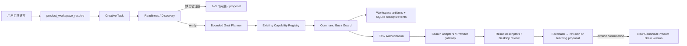

# M10 产品认知驱动的自主创作智能体：实施与恢复说明

> 状态：PARTIAL（实现已本地提交为 `33d096f` 并通过离线验证；未推送、未发布；真实 Provider 与平台抓取尚待用户现场验收）
> 日期：2026-07-15
> 分支：`product-creative-runtime`
> 实现提交：`33d096fa1a4439ef7fbcc7ee9ccb653332582414`

## 1. 目标与非目标

M10 把“从自然语言逐步了解产品”和“围绕已了解产品自主创作”合并成一个可恢复闭环：

```text
自然语言目标
→ 定位产品与交付物
→ 读取 Canonical Product Brain / 素材 / 历史反馈
→ 计算任务级 Readiness
→ 追问最多 3 个关键问题
→ 形成受能力注册表约束的计划
→ 经任务授权搜索灵感、选择素材
→ 生成文案 / 图片 / 视频
→ 交付、修改与反馈
→ 长期信息形成 proposal
→ 字段级确认后生成新 Brain 版本
```

本次不实现 GEO 自动发帖、矩阵生产、投放效果分析、多人云平台、Theme Brain、新 Provider、新抓取器或 Skill 自动改代码。Hermes core 没有增加 Product Creative 专属工具；业务继续留在 `.hermes/plugins/product_creative/`。

## 2. 关键架构决策

1. `product_workflow_run` 仍是唯一公开自然语言入口；显式 `action` 保持旧 workflow 兼容。
2. `product_workspace_resolve` 继续负责产品名称、别名和多候选解析，不新建第二套路由。
3. Goal Planner 只能选择 capability registry 中已有动作，最多 24 步；它编排现有能力，不复制其实现。
4. Creative Task、Discovery、Readiness 和 Plan 复用 workspace artifact repository；workflow/event/receipt/provider task 继续使用现有 SQLite durable runtime。
5. 对话负责创建和继续任务；Desktop 负责状态查看、审阅、确认与恢复。
6. real provider 同时需要任务级授权和运行时 `PRODUCT_CREATIVE_ENABLE_REAL_PROVIDER=1`；默认环境绝不因授权记录存在而自动发起外部调用。

## 3. 产品认知四层

| 层 | 内容 | 可否作为产品事实 |
|---|---|---|
| Evidence Inbox | 用户原话、包装图、说明书、官方/网页/平台资料、分析与反馈 | 否 |
| Draft Understanding | Hermes 对 evidence 的结构化理解、冲突和 UNKNOWN | 否 |
| Canonical Product Brain | 字段级 proposal 经用户确认后的长期事实、边界和偏好 | 是 |
| Task Context | 当前任务的渠道、主题、剧情、风格、临时修改 | 仅当前任务 |

字段状态统一为 `CONFIRMED`、`INFERRED`、`UNKNOWN`、`CONFLICTED`。用户回答“不确定”会保留 UNKNOWN；外部网页、XHS/抖音内容和模型推断均以 `not_product_fact=true` 进入 evidence/inspiration，不能直接改变 Canonical Brain。

`product_ingest` 现在保存 raw evidence、draft state 和 `draft_understanding` artifact，不直接创建 Canonical 版本。唯一写回通路仍是 proposal → explicit confirmation → Command Bus → receipt/event → 新 Brain 版本。

## 4. 新增契约与状态机

版本化文档：

- `product_creative.creative_task.v1`
- `product_creative.discovery_session.v1`
- `product_creative.product_readiness.v1`
- `product_creative.creative_task_plan.v1`
- `product_creative.task_authorization_request.v1`
- `product_creative.task_authorization.v1`

Creative Task 正常状态：

```text
UNDERSTANDING → NEEDS_INPUT → READY → RESEARCHING → IDEATING
→ PREPARING_ASSETS → GENERATING → DELIVERING
→ AWAITING_FEEDBACK → COMPLETED
```

失败/停止状态：`BLOCKED_PRODUCT`、`BLOCKED_AUTHORIZATION`、`BLOCKED_PROVIDER`、`FAILED_RETRYABLE`、`FAILED_FINAL`、`CANCELLED`。

任务保留原始自然语言目标；用户修改结果时追加 revision，不覆盖原始目标。每一步重新读取 durable task，并以幂等键避免重复提交。

## 5. Readiness 与主动追问

Readiness 按本次交付物计算，不要求先填满所有产品资料。当前硬门禁包括：

- 产品身份不能唯一确定；
- SKU/当前包装版本不明确；
- 真实图片/视频要求出现产品，但没有已登记的 `current_main_image`、`video_first_frame` 或 `product_photo`；
- 可用/禁用表述未确认；
- 包装保真要求与生成路线冲突；
- Provider、凭据、授权或调用上限不足。

问题按合规/真实性、产品身份、SKU、当前包装、交付规格排序，每轮最多 3 个。明确 UNKNOWN 的非阻塞字段不会机械重复询问。纯文字“就用最新包装”不能成为包装证据；必须走现有素材登记流程。

“先了解产品/完善产品大脑”被识别为 understanding goal，不会虚构图片或视频交付；用户随后说明交付类型时，在同一 task 内重建计划，作为 Task Context，不写 Canonical Brain。

## 6. 自主编排与调用链



按任务需要编排 product、inspiration、material、content、image、video、review、learning、recovery 域。文本任务可独立交付；图片和视频复用现有 brief、payload、readiness 与 provider gateway；混合任务按图片 → 视频依赖顺序执行。

内部候选继续由现有 inspiration/content 能力生成和排序。当前实现保存 `selected_idea` 与 `selected_materials`；复杂开放式 LLM 创意评分仍依赖 Hermes/既有能力，不新增自由工具调用器。

## 7. 外部研究与授权边界

任务授权明确保存：允许的数据源、是否允许浏览器 Cookie、图片/视频最大调用次数和 8 小时有效期。授权只属于当前 task，永不包含 Product Brain 写回。

- 普通“抖音产品视频”只表示渠道，不自动授权抖音抓取。
- 只有出现搜索/抓取/搜集/查找/参考帖子/爆款灵感等明确研究意图，才把相关平台加入授权范围。
- 仅网页时返回 `web_search`；含 XHS/抖音时返回 `authorized_source_adapters` 及精确 `authorized_sources`。
- Hermes 收集后通过现有 external source snapshot 导入，强制 `not_product_fact=true`。
- 来源失败可由用户明确选择“跳过实时，使用已有”，任务降级到确认的 Product Brain 和历史灵感，并记录 `used_realtime_information=false`。

本轮没有执行任何真实网页、XHS、抖音或浏览器 Cookie 操作。

## 8. Provider 提交、恢复与费用安全

Mock provider 使用现有 durable provider 路径，测试不联网、不计费。Live 路径满足以下全部条件才可提交：

1. Readiness 通过；
2. 用户确认当前 task authorization；
3. Provider readiness/凭据通过；
4. 运行时显式设置 `PRODUCT_CREATIVE_ENABLE_REAL_PROVIDER=1`；
5. 对应调用次数未耗尽。

图片 live 提交完成后继续交付步骤。视频 live 提交保存可恢复的 provider task id，状态进入 `GENERATING`；再次用自然语言继续 task 时查询状态。提交消耗一次视频调用额度，状态查询不再次计费，因此在授权为 `CONSUMED` 后仍可恢复轮询；授权过期则停止。

默认环境中，即使用户已授权，也只返回 `READY` 和明确提示，不会自动打开真实 Provider。测试中的 live runner 使用进程内 Fake Gateway，未访问网络。

## 9. 反馈和长期学习

- 普通修改：记录 result feedback，追加 task revision，重置后续计划并申请新的任务授权；不写 Brain。
- 长期偏好/产品纠正：绑定具体 feedback ID 形成 learning proposal；Canonical Brain 指纹保持不变。
- 用户显式确认 proposal 后：通过现有 Command Bus 创建 receipt/event 和新 Brain version，task 才可完成。

Skills 只保存稳定流程，不保存产品事实；M10 不允许 Agent 自动修改正式 Skill。

## 10. Desktop 增量

保持 Product Creative plugin-owned `desktop_ui/index.js` 和五个既有视图：

- Overview：Product Readiness 与高价值问题；
- Tasks：原始目标、阶段、阻塞、计划、授权、素材与结果；
- Review：Creative Task、创意预览、字段/学习 proposal 与确认；
- Assets：本次输入素材、生成结果和媒体描述符；
- Learning：反馈、Brain 版本和长期规则。

新增只读 API：

- `GET /products/{product_id}/creative-tasks`
- `GET /products/{product_id}/creative-tasks/{task_id}`

API 保持 workspace/product 隔离；没有在 Hermes core 增加 Product Creative 专属路由。

## 11. 修改文件（按职责）

领域/契约：

- `contracts/models.py`
- `brain/discovery.py`
- `brain/learning.py`
- `capabilities/product/schemas.py`
- `capabilities/product/ingestion_service.py`
- `capabilities/product/commands.py`

编排/授权/运行：

- `application/planner.py`
- `runtime/creative_tasks.py`
- `runtime/authorization.py`
- `runtime/agent.py`
- `ports/runtime_repositories.py`
- `stores/filesystem.py`

反馈/学习：

- `capabilities/learning/executor.py`
- `capabilities/learning/feedback_service.py`
- `capabilities/learning/writeback_service.py`

Desktop/查询：

- `application/console_queries.py`
- `dashboard/plugin_api.py`
- `desktop_ui/index.js`
- `infrastructure/m9_repository.py`
- `apps/desktop/src/app/desktop-plugins/product-creative-bundle.test.ts`

测试/兼容：

- `tests/hermes_cli/test_product_creative_m10.py`
- `scripts/verify_public_surface_golden.ps1`

长期知识/交接：

- `AGENTS.md`
- `docs/M10_PRODUCT_COGNITION_AUTONOMOUS_CREATION_IMPLEMENTATION.md`
- `docs/plans/2026-07-14-m10-zero-to-product-brain-plan.md`
- `docs/PROJECT_STATE.md`
- `docs/ROADMAP.md`
- `docs/AI_HANDOFF.md`
- `docs/DECISION_LOG.md`
- `docs/ARCHITECTURE_CURRENT.md`
- `docs/MVP_SCOPE.md`
- `docs/OPEN_QUESTIONS.md`

工作区共有 32 个 M10 相关修改/新增文件。既有未跟踪 `pytest-of-unknown/` 不属于 M10，不删除、不提交。

## 12. 验证证据

已执行且成功（最终复验）：

- M10 Python：24 passed；覆盖自然语言请求、Readiness、UNKNOWN、字段确认、授权、研究导入/降级、素材选择、Mock 文/图/视频、混合任务、反馈学习、workspace 隔离、Desktop read model、真实 Hermes agent loop、Fake live submit/recovery。
- Desktop SDK Node bundle：2 passed；routes/registry/page/Product Creative UI：16 passed；backend API/distribution：15 passed；distribution bundle：1 passed。
- Desktop TypeScript typecheck 与 production build passed。
- M9 review/recovery：25/25。
- Product Brain boundary 0 failures；contract 51 actions；public-surface golden 保持 84 tools / 84 CLI。
- 分发版本/哈希/敏感扫描与临时 enabled user-plugin 离线安装通过。
- `git diff --check`（仅 Windows CRLF warning）。

最终命令和精确结果以 `docs/PROJECT_STATE.md` 为准。本轮明确没有运行：真实图片/视频/VLM、付费 Provider、网页/XHS/抖音抓取、生产 API。

## 13. 已知限制与未完成验收

1. 用户尚未亲自验收一次新产品多轮建脑和一次真实视频交付，因此 M10 不能标记 DONE。
2. XHS/抖音 sidecar 在仓库外，本轮只完成授权/动作请求/降级契约，没有现场验证登录、Cookie、限流和抓取结果。
3. 真实 Provider runner 已接入现有 gateway，但未使用真实凭据/网络验证；只以 Fake Gateway 验证提交一次与可恢复轮询。
4. `verify_m2_workflow_run.ps1` 在 Windows 嵌套 PowerShell 下长时间无输出，未完成；不能声称通过或失败。
5. `pytest-of-unknown/` 是既有未跟踪测试临时目录，本轮未删除、未提交。
6. 完整模型配置中心、创作画布、视频时间轴不属于 M10。

## 14. 工作区丢失后的恢复顺序

1. 读取 `AGENTS.md`、`docs/AI_HANDOFF.md`、`docs/PROJECT_STATE.md`、`docs/MVP_SCOPE.md`、`docs/ARCHITECTURE_CURRENT.md`。
2. 读取本文和 `docs/plans/2026-07-14-m10-zero-to-product-brain-plan.md`。
3. 运行 `git status --short`、`git rev-parse HEAD`，区分 HEAD 与未提交 worktree。
4. 以 `.hermes/plugins/product_creative/` 为源码真源；不要从独立分发仓库反向覆盖。
5. 检查四个 M10 schema、`product_workflow_run` 兼容参数、84/84 public surface 和 Product Brain 写回门禁。
6. 先运行 M10 mock/fixture 测试和 Desktop 定向测试；不设置 real-provider 开关。
7. 只有用户单独授权后，才在隔离 workspace、小调用上限和测试商品上做 Live 验收。

## 15. 建议提交分组（未执行）

1. M10 contracts / discovery / readiness / task planner；
2. authorization / provider recovery / feedback learning；
3. Desktop task visibility；
4. tests / public-surface compatibility；
5. M10 documentation and project state。

M10 实现和知识文档已按用户授权本地提交；未经用户再次授权，不 push、tag 或 release。
