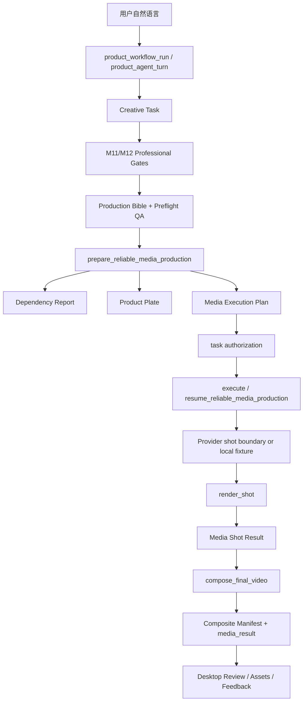

# M13 Reliable Media Production Implementation

## 1. 恢复锚点

- 日期：2026-07-16
- 分支：`product-creative-rebaseline-20260716`
- HEAD：`0aa95637213f02eca2ef8f619daaf771150a7e11`
- 状态：`DONE_IN_WORKTREE_UNCOMMITTED_UNPUBLISHED_LIVE_GATE_PENDING`
- 源码真源：`.hermes/plugins/product_creative/`
- 当前实现未经 Git commit、push、tag 或 release。

本文记录 M13 从 Production Bible 到可播放本地 MP4 的实际实现、测试证据、
恢复顺序和剩余边界。它描述的是当前 worktree，不表示独立云端分发仓库已经更新。

## 2. 目标与非目标

M13 的目标是把 M11/M12 已审阅的创意、剧情、逐镜头规格和合规 Gate 转换为
可恢复的媒体生产：

```text
Production Bible
→ Dependency Report
→ Product Plate
→ Media Execution Plan
→ 逐镜头背景生成/fixture
→ 产品 plate 与确定性字幕合成
→ 标准化镜头
→ 最终 MP4 与 Composite Manifest
```

本阶段没有：

- 替换 Product Brain、Creative Task、Command Bus 或 Provider Gateway。
- 新增第二套聊天入口、任务数据库或 Hermes core 业务路由。
- 自动修改 Canonical Product Brain。
- 自动执行真实网络、Cookie 或付费 Provider。
- 实现生成后包装、文字、人物和剧情的自动视觉 QA/返修；该职责属于 M14。
- 拆分独立源码仓库、提交或发布。

## 3. 迁移前后差异

迁移前存在两条不完整路线：

- `exact-main` 可以保持主图不被生成模型重绘，但主要是固定主图、通用字幕和装饰，
  缺少逐镜头创意执行。
- 普通 Seedance 可以产生运动和场景，但会重绘包装中文文字，不能证明包装保真。

M13 采用混合 Shot Graph：

- Provider 只负责背景、场景、人物和装饰媒体。
- 产品包装来自不可变 Product Plate，只允许等比缩放、平移和 alpha overlay。
- 中文字幕和品牌文字由本地 ASS/libass 确定性渲染。
- 每个镜头独立生成、标准化、保存和重试。
- 最终视频由本地 ffmpeg 按计划顺序拼接。

这条路线解决“创意表现”和“包装保真”不能同时满足的问题，但不承诺生成背景本身
已经达到可发布质量；M14 仍需对最终媒体做视觉 QA。

## 4. 新增工件

所有工件继承现有专业工件契约，拒绝额外字段并使用 SHA-256 内容哈希：

| Schema | 职责 |
|---|---|
| `product_creative.media_dependency_report.v1` | ffmpeg、编码器、字体、磁盘、素材、Bible 和 Provider readiness |
| `product_creative.product_plate.v1` | 产品源素材、源哈希、plate 路径、mask 模式和允许/禁止变换 |
| `product_creative.media_execution_plan.v1` | 逐镜头顺序、时长、执行模式、prompt、caption、预算和幂等键 |
| `product_creative.media_shot_result.v1` | 单镜头单次 attempt 的输入、输出、Provider、错误和可恢复状态 |
| `product_creative.media_composite_manifest.v1` | 最终镜头顺序、输出哈希、编码、字幕模式和命令摘要 |

工件存入现有 artifact repository 和 product workspace，不新增平行媒体数据库。

## 5. 核心调用链



### 5.1 自然语言入口

公开工具数量保持 `84 tools / 84 CLI`。用户仍通过原有
`product_workflow_run`/Hermes 对话启动任务，不需要知道 product id 以外的底层媒体参数。

`preview_first` 模式中：

1. 用户先看到三个方向。
2. 选择方向后任务仍保持 `NEEDS_INPUT`。
3. 只有用户明确表达“确认生产/开始生成/就按这个做”才创建任务授权请求。
4. 授权完成后才进入媒体执行。

### 5.2 Planner 与 Gate

`compose_exact_main_video` 被标记为 `task_authorization` action。M13 的依赖、plate 和
计划准备发生在 Provider 边界之前，因此授权前可以诊断，但调用次数保持为零。

包装保真意图扩展识别：

- 不得改变
- 不能改变
- 不允许改变
- 不要改变

没有 Story、Production Bible、Preflight QA、当前产品素材或正确包装路线时，不能进入
真实生成。

### 5.3 Provider Shot 边界

`provider_shots.py` 扩展现有 `GenerationProviderGateway`：

- Provider prompt 明确禁止生成产品包装、产品、品牌文字、字幕或其他可读文字。
- Product Plate 路径和字幕不进入 Provider payload。
- payload id 包含 plan content hash，避免计划修订后复用旧 payload。
- 每个镜头使用稳定的 Provider 幂等键。
- `local-fixture` 产生真实无文字/无产品背景 PNG，仍走相同合成路径。
- 真实图片和视频调用上限默认各为 5；轮询不重复扣减调用次数。

真实 Provider 仍要求任务授权和
`PRODUCT_CREATIVE_ENABLE_REAL_PROVIDER=1` 双重 opt-in。

### 5.4 Product Plate

`ensure_product_plate()` 支持：

- `source_alpha`：源 PNG 已有有效 alpha。
- `edge_connected_background`：只从边缘开始移除接近背景色的连通像素。
- `full_rect`：无法可靠抠图时保留完整矩形主图并写 warning。

前景 RGB 不被生成式重绘；源文件不修改。M13 当前能证明来源像素边界和合成方式，
不能证明所有复杂背景都可以自动得到高质量透明抠图。复杂素材应提供人工确认的 alpha。

### 5.5 本地 Compositor

`media_compositor.py`：

- 所有 ffmpeg 调用使用参数数组，不拼接 shell 命令。
- 图片或视频背景统一输出 H.264、`yuv420p` 和指定 canvas/fps。
- 无音频镜头补静音 stereo AAC，保证 concat 结构一致。
- 产品 plate 仅做 uniform scale、translate 和 alpha overlay。
- 字幕写入 `.ass` 并通过 libass 渲染。
- 最终 MP4 使用 `+faststart`。
- ffprobe 验证分辨率、时长、视频 codec 和音频 codec。

### 5.6 恢复

每次执行前重新读取 durable task、plan 和最新 shot results：

- 已完成镜头跳过，不再次提交。
- 失败镜头只增加自己的 attempt。
- 达到 `max_attempts` 后写 `FAILED_FINAL`。
- 所有镜头完成后才执行最终拼接。
- 最终结果写入兼容 `generated_videos` JSON、task `media_result` descriptor 和
  Composite Manifest。

当前 local fixture 的失败/恢复路径已通过测试。真实异步视频 Provider 的“提交后等待、
重启、下载、继续合成”仍保留为独立 Live Gate，不能用 fixture 冒充。

## 6. Desktop 投影

没有新增 Hermes 宿主业务路由。plugin-owned 五视图增加：

- Overview：媒体依赖状态、blockers 和 warnings。
- Tasks：完成镜头数、总镜头数和当前失败。
- Review：Production Bible → Plan → Manifest provenance。
- Assets：Product Plate、逐镜头输出和最终视频。
- Learning：继续使用现有反馈与 proposal 边界；M13 不自动写 Brain。

Desktop bundle 由 `desktop_ui/index.js` 生成到
`dashboard/dist/desktop.js`，当前 SHA-256：
`9d65b3fe2a6ebfffaeb948a88a4b45914716e15e774d991fc8691d7e5ff4c014`。

## 7. 媒体依赖与运行环境

当前本机验证使用：

- Node：`24.15.0`；发布权威仍是 CI Node 22。
- ffmpeg：
  `C:\Program Files\AIMIXMaster\resources\app.asar.unpacked\node_modules\ffmpeg-static-all\win\bin\ffmpeg.exe`
- ffprobe：同目录 `ffprobe.exe`
- 字体：Windows 中文字体。

支持用以下环境变量显式指定媒体工具：

- `PRODUCT_CREATIVE_FFMPEG_PATH`
- `PRODUCT_CREATIVE_FFPROBE_PATH`

上述 AIMIXMaster 路径只用于当前机器的本地验收，不是产品级依赖方案。M15 Windows
安装包必须捆绑、安装或配置自己可控的 ffmpeg/ffprobe，不能依赖另一款软件的内部文件。

Windows 深层 pytest 临时路径可能触发 legacy `MAX_PATH`。本轮 E2E 使用短路径
`C:\tmp\...` 运行；真实产品 workspace 也应避免无界嵌套。

## 8. 分发修复

本轮首次离线安装失败，原因是导出脚本只读取 Git tracked 文件，新增但未提交的
`contracts/creative_artifacts.py` 等模块没有进入分发包。

修复后：

```powershell
git ls-files --cached --others --exclude-standard -- ".hermes/plugins/product_creative"
```

导出流程会包含已跟踪及尚未提交但未忽略的第一方源码；runtime、生成产物、缓存、
数据库和敏感文件仍由 Git ignore 与显式过滤排除。

临时分发包已经通过：

- 版本一致性。
- `SOURCE.json` source commit、bundle hash、payload hash。
- 敏感/个人/运行数据扫描。
- enabled user-plugin 离线安装。
- Desktop registry bundle 加载。

## 9. 验证结果

本轮没有读取或调用真实凭据，没有网络、Cookie 或付费 Provider 副作用。

| Gate | 结果 |
|---|---|
| M10–M13 Python 回归 | `119 passed` |
| 强化自然语言真实本地视频 E2E | `1 passed` |
| E2E ffprobe | 270×480、H.264、AAC、时长 ≥ 9.5 秒 |
| Desktop routes/registry/page/bundle/distribution UI | `17 passed` |
| Desktop Plugin bundle Node test | `2 passed` |
| Desktop typecheck | PASS |
| Desktop production build | PASS；只有既有 CSS/large chunk warning |
| Desktop backend/distribution tests | `15 passed` |
| Distribution regression | `4 passed` |
| M9 review/recovery | `25/25` |
| Public surface golden | `84 tools / 84 CLI`，hash 匹配 |
| 临时分发安全验证 | PASS |
| 临时 enabled user-plugin 离线安装 | PASS |

自然语言主验收流程：

```text
“先给我看三个10秒竖屏剧情视频方向，包装和文字不能改变”
→ 选择 B，产品约第 4 秒出现
→ “确认生产，就按这个生成”
→ 返回 task authorization
→ 用户确认本地 fixture 生成
→ 生成逐镜头媒体、Product Plate、确定性字幕和最终 MP4
→ task 进入 AWAITING_FEEDBACK
```

验收同时证明 Canonical Product Brain content hash 未变化。

## 10. 完整修改文件（按职责）

### 媒体契约与持久化

- `.hermes/plugins/product_creative/contracts/creative_artifacts.py`
- `.hermes/plugins/product_creative/contracts/__init__.py`
- `.hermes/plugins/product_creative/runtime/professional_artifacts.py`

### 媒体生产

- `.hermes/plugins/product_creative/runtime/media_dependencies.py`
- `.hermes/plugins/product_creative/runtime/product_plate.py`
- `.hermes/plugins/product_creative/runtime/media_plan.py`
- `.hermes/plugins/product_creative/provider_shots.py`
- `.hermes/plugins/product_creative/runtime/media_compositor.py`
- `.hermes/plugins/product_creative/runtime/media_production.py`

### 现有任务与 Provider 集成

- `.hermes/plugins/product_creative/application/planner.py`
- `.hermes/plugins/product_creative/contracts/models.py`
- `.hermes/plugins/product_creative/runtime/authorization.py`
- `.hermes/plugins/product_creative/runtime/creative_tasks.py`
- `.hermes/plugins/product_creative/provider_ports.py`
- `.hermes/plugins/product_creative/provider_gateway.py`
- `.hermes/plugins/product_creative/capabilities/video/exact_video_service.py`

### Desktop

- `.hermes/plugins/product_creative/application/console_queries.py`
- `.hermes/plugins/product_creative/desktop_ui/index.js`
- `.hermes/plugins/product_creative/dashboard/dist/desktop.js`
- `apps/desktop/src/app/desktop-plugins/product-creative-bundle.test.ts`

### 分发与测试

- `.hermes/plugins/product_creative/scripts/export_distribution.ps1`
- `tests/hermes_cli/test_product_creative_m10.py`
- `tests/hermes_cli/test_product_creative_m11_artifacts.py`
- `tests/hermes_cli/test_product_creative_m13_media_production.py`
- `tests/hermes_cli/test_product_creative_distribution.py`

### 计划与长期知识

- `docs/plans/2026-07-16-m13-reliable-media-production-design.md`
- `docs/plans/2026-07-16-m13-reliable-media-production-implementation-plan.md`
- `docs/M13_RELIABLE_MEDIA_PRODUCTION_IMPLEMENTATION.md`
- `AGENTS.md`
- `docs/AI_HANDOFF.md`
- `docs/PROJECT_STATE.md`
- `docs/ROADMAP.md`
- `docs/MVP_SCOPE.md`
- `docs/ARCHITECTURE_CURRENT.md`
- `docs/DECISION_LOG.md`
- `docs/PRODUCT_AGENT_DIRECTION.md`

M11/M12 仍有同一 worktree 中受保护的未提交修改；不能把整份 `git diff` 都误归因于
M13。

## 11. 已知限制

- 真实豆包/Seedance shot 的异步提交、轮询、下载、重启恢复和最终合成本轮没有执行。
- local fixture 证明生产契约和真实 MP4，不证明实际 Provider 的创意质量。
- Product Plate 自动抠图只适用于 alpha 或相对简单的边缘背景。
- 没有最终媒体视觉 QA、OCR 包装比对、人物连续性、字幕可读性或自动返修。
- 本机 ffmpeg 来源不是可发布依赖。
- Desktop 只投影生产状态，不是完整时间线编辑器。
- 当前 worktree dirty，生产 build stamp 固定到 HEAD 但包含未提交代码，不能发布。

## 12. 工作区丢失后的恢复顺序

1. 读取 `AGENTS.md`、`docs/AI_HANDOFF.md`、`docs/PROJECT_STATE.md`。
2. 读取 `docs/PRODUCT_AGENT_DIRECTION.md`、`docs/ARCHITECTURE_CURRENT.md`。
3. 读取 M11、M12 和本文，理解专业工件 → Skill → 媒体生产链。
4. 确认分支、HEAD、dirty 状态和未跟踪文件，不清理。
5. 确认 M13 新模块全部存在并能导入。
6. 设置隔离的 ffmpeg/ffprobe 路径；清除真实 Provider credential 环境变量。
7. 运行 M10–M13 回归和自然语言本地视频 E2E。
8. 重建 Desktop bundle，运行 UI/typecheck/build。
9. 导出到仓库外临时目录，验证扫描和离线安装。
10. 只有真实 Live Gate 经用户单独授权并成功后，才移除
    `LIVE_GATE_PENDING`。

## 13. 兼容性检查

- 公开工具和 CLI 数量保持 84/84。
- manifest/API/Desktop SDK 版本保持 `9.1.0-alpha.1` / v1。
- 无专业工件的 legacy exact-main 直接调用仍保留。
- 现有 Creative Task schema version 未另建 v2 数据库。
- 现有 review、feedback、learning 和 recovery 继续读取兼容 result descriptor。
- 分发仓库仍由发布 workflow 生成，当前不直接维护。

## 14. 建议提交分组

等待用户单独授权后再执行：

1. `feat(product-creative): add M13 media execution contracts`
2. `feat(product-creative): add recoverable hybrid media production`
3. `feat(product-creative): expose M13 production state in desktop`
4. `fix(product-creative): include uncommitted first-party sources in release candidate export`
5. `test(product-creative): verify natural-language local video production`
6. `docs(product-creative): record M13 implementation and recovery`

## 15. 下一阶段

唯一推荐下一任务是 M14 自动媒体 QA、返修与学习质量：

- OCR/视觉比对包装和关键文字。
- 检查人物、场景、镜头连续性、字幕、音画和技术规格。
- 输出 QA Report 与 Repair Decision。
- 只重做失败镜头并重新合成。
- 把用户“通过/修改/拒绝及原因”安全送入现有 learning proposal。

未经新的实施授权，不开始 M14 编码；未经单独 Live 授权，不执行真实 Provider。
