# M9.1 Desktop Plugin SDK 实施与恢复说明

## 状态快照

- 日期：2026-07-15
- 分支：`product-creative-runtime`
- M9.1 实现提交：`83b4e8f`
- 插件版本：`9.1.0-alpha.1`
- 已提交基线：M9 review/recovery
- 当前状态：M9.1 `DONE / committed locally / unpushed / unpublished`
- 源码真源：`.hermes/plugins/product_creative/`
- 分发仓库：`cynic12138/hermes-product-creative`，只能由发布流程生成

本文档记录 M9.1 的实际实现、验证证据和恢复方法。实现已进入本地分支，尚未进入远程仓库或正式发布。

## 1. 这次迁移解决什么问题

M9 在 Hermes Desktop core 中直接维护 Product Creative 专属路由、React 页面和 API client。它可以工作，但会让 Product Creative 的升级、独立分发和 Hermes 上游同步持续依赖修改宿主。

M9.1 用通用 Desktop Plugin SDK 替换该专属宿主页面：

```text
M9：Hermes core -> Product Creative 专属 route/component -> plugin backend
M9.1：Hermes core -> 通用 Desktop Plugin SDK -> plugin-owned bundle -> plugin backend
```

迁移目标：

- Hermes core 只提供通用插件发现、bundle 校验、动态路由和宿主能力。
- Product Creative 自己拥有 `/product-creative` 页面和业务 UI。
- 同一份插件源码可以导出为独立 user plugin。
- 分发前能验证版本、哈希、敏感数据和离线安装链路。

明确非目标：

- 不增加新的内容创作能力。
- 不实现 M10“从 0 对话建脑”。
- 不修改 Product Brain 数据、数据库结构或既有业务接口语义。
- 不调用真实图片、视频、VLM、XHS/Douyin 或生产服务。

## 2. 当前架构与调用链

```mermaid
flowchart LR
    A["Hermes Desktop 启动"] --> B["GET /api/desktop/plugins"]
    B --> C["校验 manifest 与保留路由"]
    C --> D["GET /api/desktop/plugins/{name}/bundle"]
    D --> E["校验名称/版本/API/entry/大小/SHA-256"]
    E --> F["bundle 调用 registerPage"]
    F --> G["Desktop registry 注册动态路由"]
    G --> H["DesktopPluginPage mount"]
    H --> I["plugin-owned 五视图 UI"]
    I --> J["/api/plugins/product_creative/v1"]
    J --> K["Command Bus / capability services"]
    K --> L["SQLite durable state + workspace files"]
```



直接访问 `/product-creative` 时，宿主先等待插件 discovery 结束。路由在加载期间不会被错误解释为聊天 session ID；失败时显示插件级可诊断错误，不静默跳回聊天。

## 3. Desktop Plugin SDK v1 契约

### 3.1 Manifest

`plugin.yaml` 和 `dashboard/manifest.json` 必须保持以下字段一致：

| 字段 | 当前值/约束 |
|---|---|
| `desktop.api_version` | `1` |
| `desktop.path` | `/product-creative`，不得与完整宿主路由表冲突 |
| `desktop.entry` | `dashboard/dist/desktop.js`；只允许安全的 `.js`/`.mjs` 相对路径 |
| `desktop.position` | `after:artifacts` |
| `desktop.label` | `Product Creative` |
| `desktop.icon` | `review` |

构建脚本在生成 bundle 前比较两份 manifest，拒绝契约或版本漂移。

### 3.2 宿主 API

- `GET /api/desktop/plugins`：返回已启用的 bundled/user plugin Desktop manifest。
- `GET /api/desktop/plugins/{name}/bundle`：返回经过认证和校验的 bundle source、name、version、API version、entry 与 SHA-256。

两条 API 都使用现有 Desktop 认证。project plugin 不能通过这两条 API 注入可执行页面或 backend API。

### 3.3 注册和宿主能力

插件 bundle 必须且只能注册自身：

```js
window.__HERMES_DESKTOP_PLUGINS__.registerPage({
  apiVersion: 1,
  name: 'product_creative',
  mount
})
```

`mount(root, host)` 获得：同源 API 请求、媒体预览、继续聊天、当前 locale 和当前 `workspaceRoot`。返回的 cleanup 会在卸载、locale 切换或 workspace 切换时执行。

注册事务阻止重复注册、跨插件覆盖、错误注册名和 bundle 未注册页面；单个插件失败不会破坏其他插件。

## 4. 安全与隔离边界

- 仅加载 enabled bundled/user plugin；project plugin 被拒绝。
- 插件名、路径穿越、扩展名、API version、version、entry 和 bundle identity 都会校验。
- bundle 最大 2 MiB，并使用 SHA-256 进行后端与 renderer 双重完整性校验。
- 所有宿主内置路径来自统一 `APP_ROUTES`，包含 `/command-center`、`/starmap` 等，不维护漂移的第二份硬编码列表。
- enabled Desktop plugin 是与宿主同源执行的受信任代码。`workspaceRoot` header 用于正确选取工作区，不是针对恶意插件的沙箱。
- 分发扫描拒绝 SQLite、workspace、artifact、媒体、prompt、Cookie、Token、密钥、个人目录、个人邮箱和身份证模式；错误只报告规则和位置，不打印秘密值。

## 5. Product Creative 插件页面

页面源码位于 `desktop_ui/index.js`，提供：

- Overview：产品与运行状态概览。
- Tasks：workflow 列表和详情。
- Review：待审阅 proposal 和受控决策。
- Assets：素材与媒体 descriptor。
- Learning：学习提案、规则和恢复动作。

页面具有 loading、empty 和 error 状态。活动产品按 `workspaceRoot` 分开记忆；切换 workspace 后组件 cleanup、重新 mount 并重新读取数据，避免产品 ID、缓存和媒体路径串库。

Product Brain 变更、rollback、rule revoke、workflow retry/cancel 等受控操作采用两阶段调用：第一次返回 confirmation ID；用户填写原因后，第二次携带 `confirmed=true`、confirmation ID、reason 和 actor。未确认操作不能改变 durable state；确认后必须产生 receipt/event。

## 6. 构建与发布

1. `build_desktop_bundle.py` 从 `desktop_ui/index.js` 生成 `dashboard/dist/desktop.js` 与 backend-only bundle。
2. `export_distribution.ps1` 只导出 Git tracked 插件源码和精确生成的 bundle；`dashboard/dist/*` 不是业务源码真源。
3. 导出目录写入 `SOURCE.json`，记录源 commit、插件版本、bundle SHA-256 和 payload SHA-256。
4. `validate_distribution.py` 验证内容、版本、大小、哈希和敏感数据规则。
5. `verify_distribution_install.py` 在临时 HOME 中从 `file://` 安装并启用 user plugin，启动隔离 backend，验证 discovery、bundle、route/API、review confirmation 和 recovery。
6. GitHub Actions 只在所有门禁通过后才允许覆盖生成仓库、原子推送 main+tag 并创建 release。本次没有触发该流程。

## 7. 文件职责清单

### 通用 Desktop SDK

- `apps/desktop/electron/desktop-plugin-bundle.cjs`：renderer bundle 契约和完整性校验。
- `apps/desktop/electron/main.cjs`、`preload.cjs`：通用 Desktop bridge。
- `apps/desktop/src/app/desktop-plugins/registry.ts`：发现、加载、注册事务和错误隔离。
- `apps/desktop/src/app/desktop-plugins/page.tsx`：mount、host API、workspace/locale lifecycle。
- `apps/desktop/src/app/routes.ts`、`desktop-controller.tsx`：完整路由真源、冷启动等待和插件页面选择。
- sidebar、command palette、类型和 i18n 文件：只显示 ready plugin，不含 Product Creative 专属业务代码。

### Product Creative 插件

- `.hermes/plugins/product_creative/desktop_ui/index.js`：插件自有五视图页面。
- `plugin.yaml`、`dashboard/manifest.json`、`dashboard/plugin_api.py`、`README.md`：v1 契约和 `9.1.0-alpha.1` 版本。
- `build_desktop_bundle.py`：生成 Desktop 分发 bundle。
- `export_distribution.ps1`、`validate_distribution.py`、`verify_distribution_install.py`：导出、扫描和隔离安装 E2E。

### Backend 与测试

- `hermes_cli/web_server.py`：通用 authenticated discovery/bundle API。
- `desktop-plugin-bundle.test.cjs`：bundle 安全契约。
- `routes.test.ts`、`desktop-plugins/*.test.ts(x)`：动态路由、registry、lifecycle、Product Creative UI 和导出 bundle。
- `tests/hermes_cli/test_desktop_plugin_pages.py`：Desktop plugin API。
- `tests/hermes_cli/test_product_creative_distribution.py`：分发 validator。
- `.github/workflows/product-creative-publish.yml`：Node 22 发布门禁与生成仓库发布。

### 被替换的专属宿主实现

`apps/desktop/src/app/product-creative/` 下的 API、页面和路由测试在 `83b4e8f` 删除。不要恢复为第二套平行 UI；历史实现仍可从其父提交 `822d879` 查看。

## 8. 2026-07-15 验证证据

| 验证 | 结果 |
|---|---|
| Python canonical wrapper：Desktop API + distribution | 15/15 PASS |
| Node 22 Desktop bundle | 2/2 PASS |
| routes/registry/page/Product Creative UI | 16/16 PASS |
| TypeScript typecheck | PASS |
| Desktop production build | PASS，有既有 CSS/chunk size warning |
| M9 review/recovery | 25/25 PASS |
| Public surface golden | 84 tools、84 CLI，哈希一致 |
| Distribution validation | PASS |
| Offline enabled user-plugin install | PASS |
| Exported bundle registry/API E2E | 1/1 PASS |

宿主全量 `npm.cmd --prefix apps/desktop run test:ui` 退出 1，存在多个非 M9.1 基线失败，包括 backend command、settings、pane-shell、assistant timeline 和 attachment 等测试。M9.1 发布 workflow 使用上述定向套件；这些宿主失败被记录为独立技术风险，没有在本任务顺带修改。

## 9. 已知限制

- 本地实现已 commit，但尚未 push；远端仍停留在 M9。
- GitHub 发布 workflow 已静态和本地等价验证，但从未实际触发。
- enabled plugin 是受信任同源代码，不提供恶意插件隔离。
- 本地绝对媒体 descriptor 的 remote Desktop 行为未验收。
- 本次 Windows Python wrapper 曾生成 `~/Python/...`，已在用户明确授权后安全删除；随后产生的 `pytest-of-unknown/` 仍是未跟踪测试临时目录，不得擅自删除或提交。

## 10. 工作区丢失后的恢复顺序

1. 读取 `AGENTS.md`、`docs/AI_HANDOFF.md`、`docs/PROJECT_STATE.md` 和本文。
2. 确认分支、HEAD、`git status --short`；M9.1 实现基线是 `83b4e8f`。
3. 以 `.hermes/plugins/product_creative/` 为业务源码真源；不要从 `dashboard/dist` 或独立分发仓库反向开发。
4. 检查通用 SDK、plugin-owned UI、backend API、测试和 workflow 五组文件是否同时存在。
5. 运行本文第 8 节对应门禁；只有定向测试、build、扫描和离线安装全部通过才恢复为 DONE。
6. 不自动清理、stash、reset、checkout、commit 或 push。

## 11. 建议提交分组（仅建议，尚未授权）

1. 通用 Desktop Plugin SDK、backend API 和定向测试。
2. Product Creative plugin-owned UI、版本和分发工具。
3. 发布 workflow 与离线安装门禁。
4. 项目恢复、长期知识、M9.1 实施说明和 M10 计划文档。

提交前必须排除 `~/`、运行 workspace、SQLite、artifact、媒体、凭据和 `dashboard/dist/*` 生成产物。
