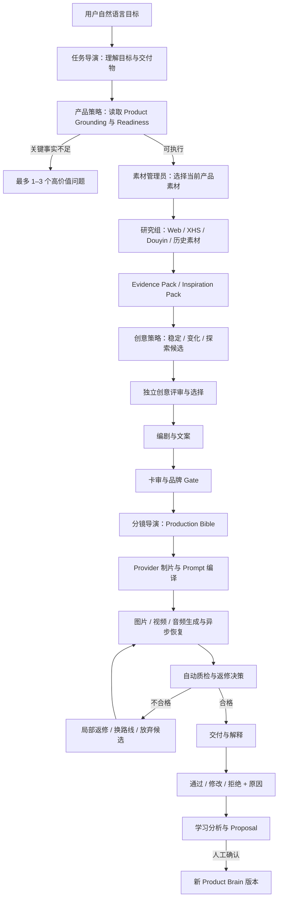
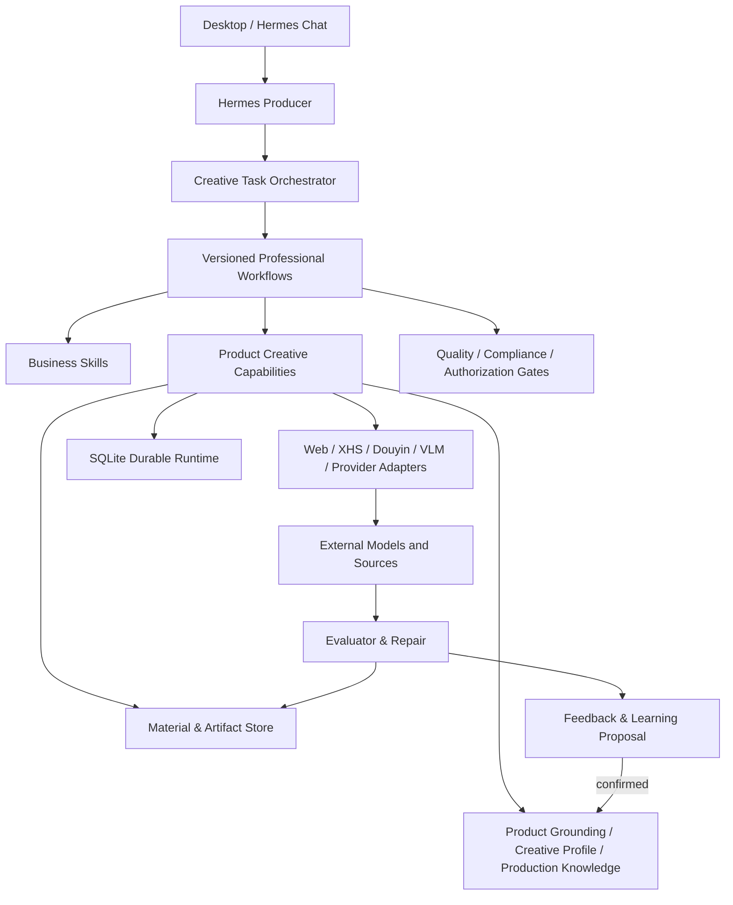

# Hermes Product Creative Agent 产品方向与终局架构

- 版本：2.0
- 修订日期：2026-07-16
- 状态：项目长期方向基线
- 适用范围：`hermes-agent/.hermes/plugins/product_creative`
- 事实基线：重建分支 `product-creative-rebaseline-20260716`，基础 HEAD `d7d6ec0bf5a4ae9a1bc2377db668ed07a8a87c0b`
- 当前实现状态：M10.1 Live 技术链路已选择性迁移并验证；创作质量未通过；下一开发任务为 M11 专业创意工作流与质量门禁

本文档是 Product Creative 后续产品设计、架构、路线图和验收的最高项目级方向依据。历史 M0–M10 文档仍用于恢复实现证据，但如果其未来设想与本文档冲突，以本文档为准。

---

## 1. 项目最终定义

### 1.1 一句话定义

Product Creative 是一个运行在 Hermes 上、围绕具体产品长期学习和工作的 AI 创意生产系统。它把优秀运营人员完成产品研究、选题、灵感收集、剧情与分镜设计、素材选择、模型调用、质量筛选和反馈复盘的能力，转化为可重复、可审阅、可恢复的专业工作流。

### 1.2 它解决的核心问题

内部运营人员已经能够借助 AI 制作产品图片和短视频，但当前流程仍高度依赖个人经验：

```text
理解产品
→ 自己找题材和参考
→ 构建 Prompt
→ 生成主图
→ 设计剧情和分镜
→ 再写视频模型 Prompt
→ 等待生成
→ 人工检查错误
→ 手工修改和重做
```

这类方式可以产出好内容，但费时、不可复制、难以批量扩展，也无法把某位优秀运营人员的判断稳定传递给其他同事。

本产品要减少的不是一次模型调用，而是整条创意生产链中重复的认知、判断、组织、生成和复盘成本。

### 1.3 最终目标

最终用户无需理解 Prompt、工具调用、Provider 参数或 Hermes CLI，只需：

1. 安装桌面端。
2. 配置必要的文本、多模态、图片和视频模型。
3. 创建或选择一个产品。
4. 上传产品资料、当前包装和可用素材。
5. 用自然语言描述目标，例如“帮我做一个今天能发的周十五产品视频”。
6. 查看系统理解的任务、选中的创意方向和最终结果。
7. 选择通过、修改或拒绝，并说明原因。

系统负责在后台完成：

```text
产品理解
→ 关键缺口追问
→ 灵感与参考研究
→ 多方向创意发散
→ 创意评审与选择
→ 剧情、文案、角色、场景和分镜
→ 素材与包装保真方案
→ Provider 适配与异步生成
→ 成片质量检查与返修
→ 交付
→ 反馈学习提案
→ 确认后升级长期认知
```

---

## 2. 目标用户、价值和成功标准

### 2.1 主要用户

第一阶段主要服务公司内部产品运营和内容运营人员：

- 熟悉产品和业务，但不要求熟悉 Prompt 工程。
- 能判断内容是否符合产品和业务需求。
- 需要持续产出产品主图、产品短视频及其基础文案。
- 希望减少重复研究、Prompt 编写、模型切换和失败重做。

系统不是面向专业程序员的 CLI 工具，也不是面向所有行业的通用视频平台。

### 2.2 第一核心价值

第一核心价值不是“系统总共生成多少条视频”，而是：

> 每名运营人员每单位时间能够确认并获得多少条真正可发布的产品内容。

大量不可用结果不构成产品价值。生成 1000 条但只有少量可用，不如生成较少、但大部分能够直接发布或只需小改。

### 2.3 核心产品指标

早期优先观察：

- 可发布图片/视频数量 ÷ 运营人员投入时间。
- 首次生成后直接通过或小改通过的比例。
- 因包装、文案、剧情、乱码或模型错误而被拒绝的比例。
- 用户从自然语言目标到取得首个可审阅结果的时间。
- 同一产品连续使用后，重复解释产品信息和偏好的次数是否下降。
- 中断任务恢复后是否会重复付费或丢失上下文。

发布后的播放、完播和互动数据可以由用户手动补充为辅助证据，但当前不建设自动投放、自动发布或自动效果分析平台。

---

## 3. 产品判断：Product Brain 必要，但不是全部

旧方向容易把 Product Brain 视为整个产品的核心。该判断只对了一部分。

Product Brain 能保证系统越来越了解：

- 产品是什么。
- 当前 SKU 和包装是什么。
- 哪些卖点有证据。
- 哪些表达允许或禁止。
- 产品适合什么品牌气质。
- 用户过去确认过哪些偏好。

但“知道产品是什么”不等于“知道今天应该拍什么”，也不等于“能把创意可靠地做成一条好视频”。

最终产品必须同时具备四个同等重要的支柱：

```text
Product Grounding
保证产品事实、包装、品牌与合规边界正确

Creative Director
决定拍什么、为什么值得拍、怎样避免空洞和同质化

Production Engine
把创意稳定转成文案、图片、音频和视频

Evaluator & Learning
判断结果是否可发布、为什么失败、如何返修和怎样学习
```

Product Brain 是 Product Grounding 与长期学习的底座，不是创意能力和质量判断本身。

---

## 4. 产品设计原则

### 4.1 一键是用户入口，不是内部实现

用户可以只输入一句话，但后台必须经过结构化生产流程。禁止把自然语言直接拼成一个大 Prompt 后交给视频模型，并把返回文件视为完成。

### 4.2 专业工作流优先于自由 Agent 群

项目不采用无边界的“灵感大师、编剧大师、卡审大师”自由聊天群。

专业能力必须被实现为以下一种：

| 类型 | 作用 |
|---|---|
| Skill | 稳定的业务方法、判断规则、输入输出要求和正反案例 |
| Capability | 可测试、可复用的领域动作 |
| Tool/Adapter | 搜索、抓取、转录、VLM、图片/视频生成等确定执行 |
| Worker | 在明确输入输出和工具白名单下完成有限研究或创意任务 |
| Workflow | 规定阶段、依赖、状态、重试、恢复和门禁 |
| Gate | 决定产物是否允许进入下一阶段 |

只有复杂研究或高价值创意判断确实需要隔离上下文时，才使用 Worker。Worker 不拥有独立 Product Brain，不直接调用付费生成，不直接写入长期认知。

### 4.3 中间产物必须可见、可验证

系统不能只保存最终视频。每个关键创意决定必须形成结构化产物，并可追溯到来源和上一阶段。

### 4.4 失败应在低成本阶段被拦截

灵感为空、创意不成立、剧情空洞、素材不足、包装路线错误或文案越界时，应在调用付费模型前阻断。

### 4.5 产品真实与创意发散分离

创意可以大胆发散场景、人物、剧情、风格和镜头，但不能发散产品事实、包装内容、健康功效和未经确认的卖点。

### 4.6 稳定复用与主动探索并存

系统不能因为用户喜欢某种风格就无限重复。默认创意候选应包含：

- 一个基于已验证模式的稳定方向。
- 一个在稳定方向上适度变化的方向。
- 一个受控探索的新方向。

### 4.7 用户默认只看三个关键节点

后台可以运行完整创意团队式工作流，但非专业用户默认只需看到：

1. 系统如何理解本次任务。
2. 系统选择了什么创意方向。
3. 最终结果及质量说明。

研究、卡审、分镜、Provider 和质检细节可以按需展开。

---

## 5. 认知与记忆架构

### 5.1 五类认知必须分开

#### A. Evidence Inbox

保存原始证据：

- 用户原话。
- 公司正式资料。
- 当前实物包装和说明书。
- 官方店铺资料。
- 产品图片、视频和 VLM 分析。
- 网页、小红书、抖音和竞品内容。
- 用户反馈和生成结果。

Evidence 不能直接作为正式产品事实。

#### B. Canonical Product Grounding

保存经过确认的长期产品真实性：

- 产品名称、SKU、包装版本。
- 成分、用途、使用方式及来源。
- 可用卖点与证明材料。
- 允许和禁止表述。
- 目标用户与适用边界。
- 当前确认主图和包装基线。
- 品牌不可改变的视觉元素。

字段状态统一为：

- `CONFIRMED`
- `INFERRED`
- `UNKNOWN`
- `CONFLICTED`

只有 `CONFIRMED` 信息可以无提示地作为正式产品事实使用。

#### C. Creative Profile

保存这个产品及其渠道适合如何表达：

- 品牌语气和视觉气质。
- 适合与不适合的题材。
- 人物、场景、节奏和镜头偏好。
- 开场钩子、产品出场方式和 CTA 偏好。
- 产品 × 渠道专属策略。
- 被用户多次确认的创作规则。

Creative Profile 不是产品事实，也不能由一次临时要求静默改变。

#### D. Production Knowledge

保存制作经验：

- 某模型在该产品上的稳定性。
- 哪类主图容易造成包装文字变形。
- 哪种合成方式能保持包装像素。
- 哪些 Prompt、镜头或字幕方式容易失败。
- Provider 参数、时长和参考素材的有效组合。
- 自动质检和人工反馈发现的稳定失败模式。

Provider 通用经验应与产品专属经验区分，避免把某次模型故障误写成产品规则。

#### E. Task Context

只保存当前任务的临时要求：

- 今日热点和节日。
- 本次题材、人物、剧情和风格。
- 本次指定素材。
- 临时渠道和交付规格。
- 本轮修改要求。

Task Context 默认随任务结束归档，不能自动升级为长期认知。

### 5.2 数据真源

不同数据有不同真源：

- SQLite：Creative Task、Workflow、Event、Receipt、Outbox、Provider Task 和恢复状态的 durable 真源。
- 版本化 Product Brain：长期产品认知、创作策略和学习规则的真源。
- Workspace 文件系统：原始证据、素材、Prompt、Production Bible、生成物和可审阅 Artifact。
- Markdown：面向人阅读的 Product Brain 投影、决策说明和恢复入口，不承担高频数据库职责。

禁止重新建设一套与现有 SQLite、Artifact Repository 或 Product Brain 平行的存储系统。

---

## 6. 最终创意生产工作流

### 6.1 总流程



### 6.2 强制中间产物

每条正式创作任务按需要产生：

1. `Creative Task Brief`：用户目标、渠道、交付物、受众、约束和授权。
2. `Product Grounding Pack`：本次可使用的产品事实、禁区和未知项。
3. `Material Pack`：选中的产品素材、用途、权利、清晰度和选择原因。
4. `Research Evidence Pack`：来源、日期、摘要、可信度和 `not_product_fact`。
5. `Inspiration Pack`：可借鉴的钩子、结构、场景、情绪、节奏和视觉手法。
6. `Creative Candidates`：稳定、变化、探索三个候选。
7. `Creative Decision`：评分、选择理由、风险、与历史内容的相似度。
8. `Story & Copy Package`：钩子、剧情、角色、对白、口播、字幕和结尾。
9. `Compliance Report`：词面规则、语义风险、画面暗示和产品边界。
10. `Production Bible`：镜头、时长、景别、机位、动作、场景、素材、声音和连续性。
11. `Provider Job Plan`：模型选择、逐镜头 Prompt、参考素材、调用次数和恢复策略。
12. `QA Report`：包装、文字、人物、剧情、技术质量和可发布性。
13. `Delivery Package`：最终文件、脚本、来源、模型、限制和修改入口。
14. `Feedback Record` 与 `Learning Proposal`。

### 6.3 关键门禁

以下情况禁止进入真实生成：

- 产品或 SKU 不能唯一确定。
- 需要真实产品出镜但没有当前确认素材。
- `selected_idea` 为空或未通过创意评审。
- Inspiration Pack 为空但任务明确要求实时灵感，且用户没有接受降级。
- 剧情类任务没有明确的钩子、推进和结尾。
- Production Bible 缺少关键镜头或素材绑定。
- 包装保真要求与生成路线冲突。
- 合规检查不通过。
- Provider、凭据、授权或调用额度不满足。

以下情况禁止作为正式交付：

- 包装、品牌或关键文字被生成模型重绘错误。
- 画面字幕乱码。
- 人物、产品或场景连续性明显破坏。
- 成片与已确认剧情或分镜不一致。
- 只有固定主图、通用字幕和装饰动画，却被标记为剧情视频。
- 自动质检失败且没有人工豁免记录。

---

## 7. 专业能力设计

### 7.1 任务导演

负责把自然语言转成 Creative Task Brief，判断用户是在了解产品、找灵感、制作图片、制作视频、修改结果还是沉淀长期偏好。

实现形态：Capability + Skill；Hermes 负责对话。

### 7.2 产品策略师

只负责准备本次可用的产品事实、包装、卖点、合规和未知项，不负责自由创意。

实现形态：现有 Product Brain、Readiness 和 Context Pack 的扩展。

### 7.3 素材管理员与视觉分析师

负责找到本地主图、包装图、历史成片和参考素材，并决定每个素材是原图、抠图、参考图还是灵感图。

实现形态：扩展现有 Material Card、Task Material Pack、Resolver 和 VLM 能力。

### 7.4 灵感研究组

按任务需要调用：

- Web：近期事实、节日、热点、品牌和竞品公开资料。
- 小红书：标题、情绪、生活场景、评论关注点和种草叙事。
- 抖音：前五秒画面、第一句话、声音、节奏、冲突、转折和完整口播结构。
- 历史库：公司已经做过的创意、失败方向和可复用资产。

实现形态：统一 Research Workflow + 来源 Adapter；复杂综合可以使用只读 Worker。

### 7.5 创意策略师

基于 Product Grounding、Inspiration Pack 和历史经验输出三个差异化候选，不能直接调用生成 Provider。

实现形态：高质量 Skill + 有界 Worker/LLM Capability。

### 7.6 创意评审与选片人

独立于创意策略师，按照产品匹配度、前五秒、故事完整性、新鲜度、渠道适配、可制作性、包装风险和合规风险评分。

实现形态：结构化 Evaluator Capability + 规则 Gate。

### 7.7 编剧、文案与分镜导演

把已选方向扩展为故事和 Production Bible。角色称谓只用于定义专业方法，不能只靠“你是世界级大师”Prompt。

实现形态：分离的 Script Skill、Storyboard Skill 和 Production Bible Contract。

### 7.8 卡审与品牌审核

由三层组成：

1. 确定性词面和字段规则。
2. Product Brain 中已确认的允许/禁止表述。
3. LLM/VLM 语义审查，包括画面暗示和人物设定。

实现形态：Policy/Gate + Compliance Skill；不得由模型单独决定最终健康或合规结论。

### 7.9 Provider 制片与 Prompt 编译器

把通用 Production Bible 编译成具体 Provider 的任务，不让业务 Skill 直接绑定厂商 API。

实现形态：扩展现有 Provider Registry、Payload、Readiness、异步 Task 和 Recovery。

### 7.10 自动质检与返修导演

检查包装、文字、人物、剧情、字幕、音画、黑帧、抖动、肢体、合规和分镜一致性，并决定局部重做、换模型、改用合成或放弃方向。

实现形态：确定性媒体检查 + VLM/视频理解 + Evaluator Skill + Repair Workflow。

### 7.11 学习分析师

区分：

- 当前结果修改。
- 一次性任务要求。
- 长期产品创作偏好。
- 产品事实修正。
- 渠道策略。
- Provider/技术经验。
- 样本不足。

实现形态：扩展现有 Feedback、Learning Proposal、Confirmation 和 Brain Version。

---

## 8. Hermes 与插件架构

### 8.1 Hermes 的角色

Hermes 继续作为：

- 对话入口。
- 任务总制片人。
- Skill 和 Tool 调用者。
- Workflow 状态解释者。
- 中断、确认和恢复入口。

Hermes 不再被允许凭单次自由判断跳过专业阶段。

### 8.2 Product Creative 的边界

所有产品业务继续位于：

```text
hermes-agent/.hermes/plugins/product_creative/
```

禁止：

- 在 Hermes core 增加周十五或 Product Creative 专属分支。
- 创建第二套 Agent Runtime。
- 创建与现有 Command Bus、Capability Registry、Durable Workflow、Repository、Provider Gateway 平行的业务系统。
- 让独立分发仓库成为源码真源。

### 8.3 目标架构



### 8.4 Redundancy Review 结论

#### REUSE

- Product workspace 和 Product Brain。
- Capability Registry、Command Bus、Guard、Receipt 和 Event。
- Creative Task、Task Authorization 和 Durable Recovery。
- Material、Inspiration、Content、Image、Video、Review、Learning、Recovery 能力。
- Provider Registry、Readiness 和异步视频任务。
- Desktop Plugin SDK 与五个插件视图。

#### EXTEND / REFACTOR_EXISTING

- Goal Planner：从静态动作串升级为受产物和 Gate 驱动的阶段编排器。
- Inspiration：从候选列表升级为有来源的 Research/Insight/Creative 输入。
- Video Brief：升级为 Production Bible，而不是只保存通用四镜头。
- Review：升级为自动 Evaluator、QA Report 和 Repair Decision。
- Learning：从混合数组升级为产品、创意、渠道和生产经验分层。
- exact-main：从通用动画模板升级为产品层与生成场景分离的混合制作路线。

#### REPLACE / DEPRECATE

- 将硬编码通用字幕和装饰动画作为“剧情视频”的做法。
- `selected_idea` 为空仍进入生成的流程。
- 只验证 Provider 返回文件、不验证创意和成片质量的验收方式。
- 依赖参数化 PowerShell 脚本证明真实用户体验的主验收方式。
- 把所有学习都写入同一个 Product Brain `learning` 列表的长期设计。

#### CREATE_NEW

只新增现有边界无法表达的职责：

- 版本化 Creative Decision 和 Production Bible Contract。
- 专业业务 Skill Catalog。
- Creative Quality Gate、Media QA 和 Repair Workflow。
- 面向非技术用户的模型配置与任务审阅体验。

---

## 9. 图片与视频生产策略

### 9.1 不能继续二选一

当前已经验证两个极端：

- exact-main 本地合成能保持主图像素，但创意和剧情过于模板化。
- Seedance 能生成运动和场景，但会重绘包装、产生中文乱码。

最终路线必须是混合制作：

```text
生成背景、人物、动作、剧情和镜头
＋
使用原始产品图、抠图或产品 plate
＋
跟踪、遮挡、缩放和后期合成
＋
本地确定性字幕和品牌元素
```

### 9.2 视频任务应按镜头生产

Production Bible 应决定：

- 哪些镜头使用真实产品素材。
- 哪些镜头允许生成式产品参考。
- 哪些镜头只生成背景和人物。
- 哪些镜头需要首帧、尾帧或角色一致性参考。
- 哪些镜头失败后可单独重做。

禁止默认把整条视频作为一个不可拆分的大 Prompt 反复重生成。

### 9.3 Provider 中立

Product Creative 保存通用创意和制作意图；Provider Compiler 负责转换为豆包或未来其他模型所需格式。

当前已确认的本机凭据优先级：

- 豆包：`DOUBAO_API_KEY`
- 硅基流动：`SILICONFLOW_API_KEY`
- DeepSeek：`DEEPSEEK_API_KEY`

只保存环境变量名称，不保存密钥值。

---

## 10. 反馈与自我迭代

### 10.1 第一阶段以人工质量反馈为主

每个可审阅结果保持：

```text
通过 / 修改 / 拒绝
+
1–3 个结构化原因
+
可选自然语言说明
```

如果用户暂不反馈，任务保持 `AWAITING_FEEDBACK`，不能把结果自动当成成功样本。

### 10.2 两类学习证据

#### 内部质量反馈

回答“是否符合公司和产品要求”，适合学习：

- 包装和产品准确性。
- 品牌风格。
- 剧情、文案和镜头偏好。
- 模型与制作失败模式。
- 什么结果可以发布。

#### 手动发布表现

回答“市场是否有反应”，可以由用户选填：

- 渠道、账号和发布时间。
- 播放、完播、互动或转化。
- 是否投流及样本说明。

发布数据只能作为带上下文的辅助证据，不能因单条样本自动升级规则。

### 10.3 学习写回

```text
任务证据
→ 学习分析
→ 判断归属和置信度
→ Learning Proposal
→ 用户审阅
→ 新版本
```

产品事实、合规、品牌规则和长期偏好永远需要明确确认。低风险技术统计可以自动积累，但升级为稳定制作规则仍需要足够样本或人工确认。

### 10.4 防止创意收敛

系统应记录创意结构、题材和视觉相似度。重复使用稳定模式时，必须保留一个受控探索候选，不能把“用户曾经喜欢”解释为“以后永远只做这一种”。

---

## 11. Desktop 最终体验

### 11.1 产品入口

Desktop 是内部运营人员的正式产品入口，Hermes 对话是主操作方式。

核心页面逐步收敛为：

- Products：产品创建、资料、包装和 Readiness。
- Tasks：自然语言目标、阶段、阻塞、调用和恢复。
- Creative Review：创意候选、剧情、分镜和高风险确认。
- Assets：产品素材、参考素材、首帧、镜头和成片。
- Learning：通过/修改/拒绝、学习提案和 Brain 版本。
- Settings：模型、凭据存在性、Sidecar 和本机依赖状态。

### 11.2 默认体验

用户输入：

> 帮我做一个今天能发的周十五产品视频，包装不要变化。

系统应：

1. 识别当前产品和包装要求。
2. 只追问阻塞性信息。
3. 说明将使用哪些数据源和是否需要授权。
4. 后台完成研究、创意、评审、分镜、卡审和生产计划。
5. 展示选中的创意方向；自适应模式可自动继续。
6. 使用混合生成路线保护产品包装。
7. 检查成片并在必要时局部返修。
8. 交付可播放文件和简洁说明。
9. 请求通过、修改或拒绝。
10. 把长期经验形成提案，而不是静默改脑。

### 11.3 不要求用户处理

- product ID。
- CLI 命令。
- JSON 或 YAML 参数。
- Provider payload。
- Prompt 工程。
- 异步任务 ID。
- 手工定位生成文件。

---

## 12. 从当前状态到最终产品的路线

历史 M0–M9 已形成 Product Brain、素材、生成、学习、恢复和 Desktop SDK 底座。M10/M10.1 证明了自然语言任务和真实外部链路，但没有证明创作质量。后续不重做底层，而是在当前能力上收敛产品质量。

当前仓库采用方案 1：产品稳定前以 Hermes 内层插件为唯一源码真源，独立仓库只承接发布流程生成的分发物；公开契约、独立安装和兼容矩阵稳定后再拆分。

### M10.2：当前成果保护与质量重新定标

目标：把当前 Live 技术成果保存下来，并正式记录本次用户验收暴露的质量缺口。

实施：

- 保留 Web、XHS、Douyin、VLM、图片、视频和 exact-main 的真实证据。
- 将两条现有视频标记为技术审计样本，而不是合格创作样本。
- 记录通用字幕、空创意、包装乱码和灵感未进入 Brief 的失败原因。
- 完成当前未提交工作区的回归、文档和提交决策。

完成条件：

- 技术链路证据可恢复。
- Product Brain 未被外部内容或失败视频污染。
- 项目状态明确区分“技术可运行”和“产品质量未通过”。

### M11：专业创意工作流与产物 Gate

目标：让任何真实生成都必须建立在完整、可检查的创意链路上。

实施：

- 引入 Creative Task Brief、Grounding Pack、Creative Candidates、Creative Decision 和 Production Bible。
- Goal Planner 改为按阶段产物和 Gate 推进。
- `selected_idea` 为空、剧情不完整或 Production Bible 不合格时阻断生成。
- 停止把通用 fallback 模板作为剧情交付。
- 建立真实 Hermes 自然语言 E2E，保存完整工具选择和中间产物。

完成条件：

- 同一句用户目标能产生可解释的三个创意候选。
- 选中方向真实进入文案、分镜和 Provider 输入。
- 任何被称为剧情视频的任务都有钩子、推进和结尾。

### M12：专业业务 Skills 与创意导演

目标：把优秀运营人员的工作方法沉淀为可测试的专业能力。

实施：

- 建立任务导演、研究、创意策略、创意评审、编剧、分镜、卡审和学习分析 Skills。
- 每个 Skill 定义触发条件、输入、输出、工具白名单、失败条件、正反案例和质量 Rubric。
- Web/XHS/Douyin 分别输出其擅长的结构化洞察，不输出泛化摘要。
- 默认稳定、变化、探索三个方向，增加历史相似度检查。

完成条件：

- Skill 输出符合稳定契约。
- 不依赖“世界级大师”角色词证明质量。
- 不同研究来源在最终创意中有可追溯引用。

### M13：Production Bible 与可靠媒体生产

目标：把高质量创意转化为可执行、可局部重做的图片和视频生产方案。

实施：

- Production Bible 覆盖角色、场景、镜头、素材、音频、字幕和连续性。
- 建立 Provider Compiler 和按镜头的任务计划。
- 实现产品 plate/抠图、生成背景和确定性字幕的混合视频路线。
- 逐镜头生成、合成和恢复；避免整条反复重做。
- 建立插件级 ffmpeg/媒体依赖发现与诊断。

完成条件：

- 当前包装关键文字不由视频模型重绘。
- 剧情、人物和场景仍可使用生成模型完成。
- 单镜头失败可以重做而不重复整条费用。

### M14：自动质检、返修与学习质量

目标：生成文件不再等同于完成，系统能主动发现和处理失败。

实施：

- 检查包装、文字、字幕、人物连续性、剧情一致性、黑帧和音画。
- 形成 QA Report、Repair Decision 和人工豁免记录。
- 通过/修改/拒绝成为标准反馈入口。
- Learning 分离到 Product Grounding、Creative Profile、Channel Strategy 和 Production Knowledge。
- 支持可选的手动发布表现记录，但不接自动投放分析。

完成条件：

- 明显乱码、包装错误和空洞模板不能被自动标记为可发布。
- 用户反馈能指导当前返修。
- 未确认 Proposal 不改变长期 Brain。

### M15：Desktop 内部试用版

目标：让不懂 Prompt 和 CLI 的内部运营人员独立完成核心闭环。

实施：

- 产品 onboarding、资料/包装补全和模型配置检查。
- 对话创建任务，三个关键节点默认展示。
- Tasks、Creative Review、Assets、Learning 和 Settings 形成连续体验。
- 本机 Sidecar、浏览器登录、Provider 和媒体依赖提供可诊断状态。
- 形成 Windows 可安装内部测试包。

完成条件：

- 内部运营人员无需开发者协助完成一次从产品到视频再到反馈的流程。
- 用户不需要接触脚本、payload 或任务 ID。
- 中断、重启和切换产品不会串库或重复扣费。

### M16：母创意与受控规模化

目标：在质量闭环稳定后提高产量，而不是提前追求原始生成数量。

实施：

- 将通过的创意保存为 Mother Creative。
- 按钩子、人物、场景、节奏、CTA 和画面风格生成受控变体。
- 队列、调用上限、去重、相似度和结果筛选。
- 支持小批量交付和人工批量审阅。
- 不实现自动发布、自动投流和矩阵账号运营。

完成条件：

- 变体继承产品和母创意约束，但不是机械换词。
- 能解释每个版本改变了什么。
- 批量失败不会污染 Product Brain 或重复消耗任务。

### Final 1.0：Product-Centric Creative Studio

最终可交付成果：

- 可安装的 Windows Desktop 产品。
- Hermes 驱动的自然语言创作入口。
- 可从零逐步建立且安全进化的 Product Brain。
- Web/XHS/Douyin 与本地素材驱动的灵感研究。
- 高质量文案、图片和产品视频专业工作流。
- 产品包装保真与生成式剧情兼容的混合生产。
- 自动质检、局部返修、任务恢复和审计。
- 人工反馈驱动的创意与制作学习。
- 母创意到小批量变体的受控扩展。

最终验收：

1. 新产品可以从名称、少量资料和素材开始，不编造未知事实。
2. 成熟产品可以从一句自然语言目标启动完整创作。
3. 用户能看到系统理解、创意选择和最终结果。
4. 搜索和平台内容增强灵感但不污染产品事实。
5. 正式视频具有具体创意和剧情，不是主图加空话。
6. 产品包装、中文文字和品牌元素满足确认的保真要求。
7. 失败结果会被识别、返修或明确拦截。
8. 用户反馈能影响当前结果，并经确认影响下一轮。
9. 一个产品连续运行后，系统能解释学到了什么、依据是什么。
10. 内部运营人员不需要 Prompt 工程、CLI 或开发者介入。

---

## 13. 明确不做与延期事项

在用户重新批准前不进入当前产品主线：

- 修改或分叉 Hermes core 形成第二套 Agent 框架。
- 无边界多 Agent 自由协作群。
- Theme Brain 独立产品。
- GEO 自动发帖。
- 自动发布、自动投流和自动投放效果分析。
- 多人 SaaS、租户、计费和云 SLA。
- Agent 自动修改正式 Skill 代码。
- 未经确认的 Product Brain、合规或品牌规则写回。
- 以向量库、消息队列或大型创作画布作为当前必要前提。
- 在质量闭环完成前追求每日上千条原始生成量。

---

## 14. 后续开发准入规则

每个新任务必须回答：

1. 它提升的是 Product Grounding、Creative Director、Production Engine 还是 Evaluator & Learning？
2. 它是否直接提高可发布内容数量或降低运营人员投入？
3. 能否复用现有 Capability、Workflow、Repository、Provider 或 Desktop SDK？
4. 是否新增了平行 Agent、存储、接口或 UI？
5. 它的中间产物和完成条件是什么？
6. 是否有真实自然语言 E2E，而不只是脚本直调？
7. 是否会产生外部调用、费用、Cookie、产品数据或 Brain 写回？
8. 失败时是否可恢复、可解释且不会重复扣费？

范围判断：

- 直接补齐当前里程碑和最终闭环：`IN_SCOPE`
- 对最终价值可能有帮助但依赖未满足：`NEEDS_APPROVAL`
- 与核心产品无关或过早平台化：`OUT_OF_SCOPE`

---

## 15. 当前下一任务

当前不应立即建设完整多 Agent 系统，也不应继续优化 exact-main 通用模板。

重建基线完成后的下一开发任务是：

> M11 专业创意工作流与质量门禁。

第一批改动只解决：

- 将现有失败视频和用户反馈固化为失败样本。
- 定义 Creative Task Brief、Creative Candidates、Creative Decision、Production Bible 和 QA Report。
- 让 Goal Planner 依赖这些产物推进。
- 阻止空 `selected_idea`、空灵感、空剧情和通用字幕模板进入真实视频生成。
- 用“帮我做一个今天能发的周十五产品视频”完成真实 Hermes 自然语言离线 E2E。

它完成后，项目才进入专业业务 Skills 和创意导演能力的开发。

详细实施规格见 `docs/plans/2026-07-16-m11-professional-creative-workflow-plan.md`。
