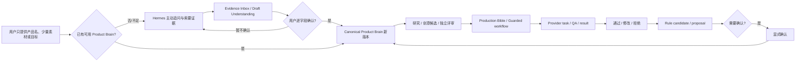

# Project Overview

## 背景与定位

Product Creative 是 Hermes Agent 的独立插件，把优秀运营人员完成产品理解、灵感研究、创意决策、分镜设计、模型调用、质量筛选和反馈复盘的工作，沉淀为围绕具体产品长期运行的专业 AI 创意生产系统。Product Brain 负责产品真实性和长期认知，专业工作流负责创意、生产、质检和学习。

**证据状态**：定位为 **CONFIRMED**；目标用户细分为 **INFERRED**。

## 目标用户与核心场景

- 目标用户：公司内部持续为同一商品制作电商主图和产品短视频、但不要求掌握 Prompt 工程的产品/内容运营人员。
- 核心场景：自然语言目标 → 产品与任务 Readiness → 灵感研究 → 三个创意候选 → 独立评审与选择 → 剧情/分镜/Production Bible → 真实生成 → QA/返修 → 审阅反馈 → 安全学习。
- 当前入口：Hermes 自然语言对话启动生成；Desktop 负责状态浏览、审阅、确认和恢复。

## 输入与输出

输入包括产品描述/图片/素材、渠道和目标、历史 artifact、用户反馈、可选手动渠道指标。输出包括 Product Brain 版本、Creative Task Brief、Research/Material/Inspiration Pack、Creative Decision、Production Bible、文案、图片/视频、QA Report、Delivery Package 和 Learning Proposal。

## 核心业务流程

## 当前范围

- Product Brain、产品摄入、素材、文案、图片、视频、外部灵感、审阅、反馈/学习、exact-main-video 技术底座。
- M10 自然语言 Creative Task、Readiness、任务授权和真实外部链路已实现；创意生产契约、专业 Skills、自动 QA 和混合视频制作仍为下一阶段。
- SQLite durable workflow、outbox、provider task、receipt、recovery。
- M9.1 已迁移为通用 Desktop Plugin SDK + plugin-owned UI，并完成离线分发验收和本地提交，尚未 push/release。

## 非当前范围

- 新 provider/爬虫、Theme Brain、GEO/自动发布、自动投流/效果分析、完整 Web 工作台、多租户/团队/计费/云 SLA。
- 未确认的自动 Product Brain 写入、付费 provider、外部发布或核心素材变更。

## 术语表

| 术语 | 定义 |
|---|---|
| Product Brain | 已确认的产品事实、包装、合规、创作偏好和长期认知；不等于完整创意系统 |
| Creative Decision | 对多个创意候选评分、选择并说明理由的结构化产物 |
| Production Bible | 角色、场景、镜头、素材、声音、字幕、连续性和 Provider 执行依据 |
| QA Report | 对包装、文字、剧情、人物、技术质量和可发布性的检查结果 |
| Evidence Inbox | 尚未成为正式认知的公司资料、包装、用户陈述、网页和外部证据 |
| Draft Understanding | Hermes 对证据的临时理解、推断、冲突和待确认字段 |
| Workflow | 可持久化、暂停、恢复、审计的步骤序列 |
| Artifact | brief、payload、结果、review/evaluation 等产物 |
| Material | 产品/竞品/历史/外部素材及元数据 |
| Guard boundary | 需要输入、确认、凭据或安全判断时停止 |
| Writeback proposal | 待审阅的长期认知更新 |
| Generation-safe context | 去除运维元数据后供下一轮使用的已确认认知 |
| Exact-main-video | 固定真实主图、不让模型重绘包装的视频路径 |

证据：`.hermes/plugins/product_creative/README.md`、`docs/history/product-creative-legacy/original/plugin-docs/PRODUCT_CREATIVE_CONVERSATION_PROTOCOL.md`、`docs/history/product-creative-legacy/original/plugin-docs/AI_DRIVEN_PRODUCT_CREATIVE_RUNTIME_ARCHITECTURE.md`。后两者仅作历史证据，当前方向以 `docs/PRODUCT_AGENT_DIRECTION.md` 为准。
