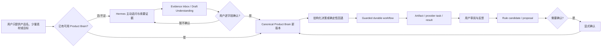

# Project Overview

## 背景与定位

Product Creative 是 Hermes Agent 的独立插件，用长期 Product Brain 取代一次性提示词式内容生产。用户可以从只有产品名称或少量素材开始；Hermes 通过自然语言主动询问、索要证据、总结缺口和提交可确认提案，逐步建立 Product Brain，再将产品事实、素材、渠道目标、生成结果和反馈组织为可审计、可暂停恢复、可确认学习的闭环。

**证据状态**：定位为 **CONFIRMED**；目标用户细分为 **INFERRED**。

## 目标用户与核心场景

- 目标用户：持续为同一商品制作小红书、抖音、电商主图和短视频内容的品牌方、商家或内容运营人员。
- 核心场景：用自然语言提出产品/目标 → Hermes 主动发现知识缺口并索要资料 → 用户逐步确认产品认知 → 生成真实图片/视频 → 审阅/反馈 → 安全沉淀规律 → 下一轮复用。
- 当前入口：Hermes 自然语言对话启动生成；Desktop 负责状态浏览、审阅、确认和恢复。

## 输入与输出

输入包括产品描述/图片/素材、渠道和目标、历史 artifact、用户反馈、可选渠道指标。输出包括 Product Brain 版本、workflow/event/receipt、文案、图片/视频 brief、provider payload/task/result、review package、evaluation、rule candidate 和 writeback proposal。

## 核心业务流程

## 当前范围

- Product Brain、产品摄入、素材、文案、图片、视频、外部灵感、审阅、反馈/学习、exact-main-video。
- 从 0 建脑的目标体验已确认；当前只有空白 Wiki、通用 ingest/缺参提示和确认写回基础，主动知识缺口访谈仍为 PARTIAL/PLANNED。
- SQLite durable workflow、outbox、provider task、receipt、recovery。
- M9.1 已迁移为通用 Desktop Plugin SDK + plugin-owned UI，并完成离线分发验收和本地提交，尚未 push/release。

## 非当前范围

- M10 guided launch、新 provider/爬虫、完整 Web 工作台、多租户/团队/计费/云 SLA。
- 未确认的自动 Product Brain 写入、付费 provider、外部发布或核心素材变更。

## 术语表

| 术语 | 定义 |
|---|---|
| Product Brain | 已确认的长期产品事实、风格、渠道和学习 |
| Evidence Inbox | 尚未成为正式认知的公司资料、包装、用户陈述、网页和外部证据 |
| Draft Understanding | Hermes 对证据的临时理解、推断、冲突和待确认字段 |
| Workflow | 可持久化、暂停、恢复、审计的步骤序列 |
| Artifact | brief、payload、结果、review/evaluation 等产物 |
| Material | 产品/竞品/历史/外部素材及元数据 |
| Guard boundary | 需要输入、确认、凭据或安全判断时停止 |
| Writeback proposal | 待审阅的长期认知更新 |
| Generation-safe context | 去除运维元数据后供下一轮使用的已确认认知 |
| Exact-main-video | 固定真实主图、不让模型重绘包装的视频路径 |

证据：`.hermes/plugins/product_creative/README.md`、`docs/PRODUCT_CREATIVE_CONVERSATION_PROTOCOL.md`、`docs/AI_DRIVEN_PRODUCT_CREATIVE_RUNTIME_ARCHITECTURE.md`。
