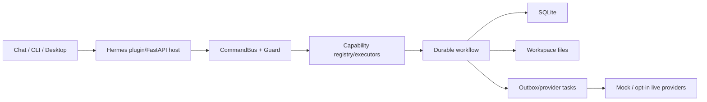

# System Architecture: Hermes Product Creative

- 日期：2026-07-12
- 状态：Recovered As-Is

## 模式

**模块化单体插件**，运行在 Hermes 宿主中。选择理由由实际代码确认：统一部署、SQLite 本地 durable state、清晰 capability/port 边界；不存在独立微服务运维或外部消息队列。

## 边界

- Hermes core 只提供通用 plugin/tool/Desktop SDK。
- Product Creative 业务、UI bundle、API、数据归插件所有。
- CommandBus/policy/confirmation 是副作用边界。
- SQLite 管运行状态和索引；文件系统管大媒体和可查看 artifact。

## API/数据/安全

- 插件 API：`/api/plugins/product_creative/v1`；M9.1 宿主 API：`/api/desktop/plugins*`。
- token/auth、enabled user plugin、path/hash/size check；命令用 409/428 表达冲突/确认。
- 主要风险：workspace header 未绑定当前 workspace 白名单，descriptor 暴露绝对路径；M9.1 本地实现提交 `83b4e8f` 尚未 push/release。

## 限制

真实 provider、sidecar、ffmpeg/Pillow、Hermes web extra 是条件依赖；NFR 量化目标、完整 E2E、coverage 和部署 SLA 缺失。

完整 as-is 文档：`docs/ARCHITECTURE_CURRENT.md`。
