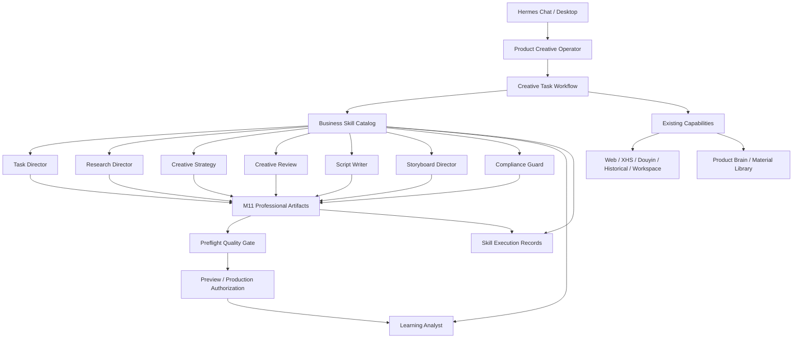

# M12 专业业务 Skills 与创意导演设计

- 日期：2026-07-16
- 分支：`product-creative-rebaseline-20260716`
- 基线 HEAD：`0aa95637213f02eca2ef8f619daaf771150a7e11`
- 状态：`APPROVED_FOR_IMPLEMENTATION`
- 前置里程碑：M11 `DONE_IN_WORKTREE_UNCOMMITTED_UNPUBLISHED`
- 源码真源：`.hermes/plugins/product_creative`

## 1. 目标

M12 将优秀运营人员完成产品内容创作时采用的稳定方法，沉淀成版本化、
可加载、可测试、可审计的业务 Skill，并让这些方法真正驱动 M11 已建立
的专业工件：

```text
Creative Task Brief
→ Product Grounding Pack
→ Research Insight Pack
→ 3 Creative Candidates
→ Creative Decision
→ Story Package
→ Production Bible
→ Preflight QA Report
```

Skill 不是角色名称或一段“你是世界级大师”的 Prompt。一个可交付的业务
Skill 必须明确：

- 何时触发以及何时不触发。
- 输入工件和输出工件。
- 允许读取或调用的 Capability。
- 事实边界、授权边界和失败条件。
- 正例、反例和质量 Rubric。
- Skill 版本、执行记录、输入输出引用和降级原因。

## 2. 本阶段范围

### 2.1 IN_SCOPE

- 任务导演。
- 来源专属研究。
- 创意策略。
- 独立创意评审。
- 编剧。
- 分镜与 Production Bible。
- 卡审与品牌审核。
- 学习分析。
- 稳定、变化、探索三个创意方向。
- 历史相似度和重复风险检查。
- Skill 执行审计。
- 真实 Hermes 自然语言离线 E2E。

业务契约面向文案、图片和视频通用任务。第一条完整验收纵切采用
10–30 秒产品短视频；文案、图片 Brief、首帧和素材策略作为视频生产的
中间产物。

### 2.2 OUT_OF_SCOPE

- 真实图片或视频 Provider 调用。
- M13 的逐镜头生成、媒体合成和 Provider Compiler。
- M14 的生成后 VLM/视频媒体 QA 与自动返修。
- 自动发布、投流、矩阵生产和 GEO。
- 无边界多 Agent 群。
- Agent 自动修改正式 Skill。
- 新数据库、新公共工具或 Hermes core 专属分支。

## 3. 现状与问题

### 3.1 可复用基础

- Hermes 插件提供 `ctx.register_skill()` 和限定命名空间的
  `skill_view("product_creative:<skill>")`。
- 插件通过 `ctx.llm` 使用宿主模型和认证。
- M11 已有八类不可变、带哈希的专业工件。
- Creative Task、Capability Registry、Command Bus、Guard、Receipt、
  Event、Artifact Repository 和 Desktop Review 已存在。
- Web、XHS、Douyin、历史素材和本地 workspace 已有 Adapter。

### 3.2 当前缺口

- 只有 `product-creative-operator` 被注册给 Hermes。
- `product-copy-pack` 只是内容生成器读取的一段提示文本。
- M11 候选、评分、剧情和分镜大部分硬编码在
  `runtime/creative_direction.py`。
- XHS、Douyin 和 Web 进入 Research Pack 时被压成通用 summary。
- `historical_difference` 是静态句子，没有真实相似度计算。
- 产物无法回答“由哪个 Skill、哪个版本、哪些输入生成”。
- 创意生成和创意审核未形成独立上下文与方法。

## 4. 方案选择

### 方案 A：自由加载八个 Skill

让 Hermes 根据当前对话自行决定 Skill 的调用顺序。

优点：改动少、表现灵活。

缺点：可能漏步骤、重复步骤、上下文漂移；任务恢复和质量验收困难。

### 方案 B：版本化 Skill Catalog + 受控创意导演

Skill 保存专业方法，现有 Creative Task Workflow 决定执行阶段和工件依赖。
Capability 执行确定动作，Gate 决定是否可进入下一阶段。

优点：

- 保留 Hermes 对话体验。
- 方法和执行状态分离。
- 可追踪、可恢复、可测试。
- 不增加公共工具和并行 Agent 系统。

缺点：需要严格定义 Skill 元数据、执行记录和结构化返回。

### 方案 C：八个独立专家 Agent

每个专业角色拥有独立 Agent 上下文并相互协作。

优点：上下文隔离明显。

缺点：成本高、错误传播复杂、状态恢复困难，容易重复 Product Brain 和
任务记忆。

### 决策

采用方案 B。

## 5. 目标架构



## 6. Skill Catalog

项目插件目录新增以下 Skill：

| Skill | 主要输出 | 允许的能力 |
|---|---|---|
| `task-director` | Creative Task Brief | product/readiness/task state |
| `research-director` | Research Insight Pack | Web/XHS/Douyin/history read |
| `creative-strategy` | 3 Creative Candidates | artifact read only |
| `creative-review` | Creative Decision | artifact/history read only |
| `script-writer` | Story Package | selected candidate and grounding |
| `storyboard-director` | Production Bible | story/material/provider capability metadata |
| `compliance-guard` | semantic QA contribution | grounding/policy/artifact read only |
| `learning-analyst` | learning proposal classification | result/feedback/history read only |

所有 Skill 都使用插件命名空间，例如：

```text
product_creative:creative-strategy
```

Skill 文件是正式源码，Agent 只能读取。任何改进进入
`skill-change proposal`，由后续开发任务人工修改。

## 7. Skill 定义契约

每个 `SKILL.md` 只保留标准、易发现的 `name` 与 `description` frontmatter。
机器可校验的契约放在同目录 `contract.json`，避免模型说明与运行时配置
混在同一段 YAML 中：

```json
{
  "name": "creative-strategy",
  "version": "1.0.0",
  "stage": "creative_strategy",
  "input_schemas": [
    "product_creative.product_grounding_pack.v1",
    "product_creative.research_insight_pack.v1"
  ],
  "output_schemas": [
    "product_creative.creative_candidate.v1"
  ],
  "tool_allowlist": [
    "artifact_read",
    "history_search"
  ],
  "failure_codes": [
    "insufficient_grounding",
    "insufficient_research",
    "invalid_candidate_diversity"
  ]
}
```

正文必须包含：

- `When to Use`
- `Inputs`
- `Procedure`
- `Output Contract`
- `Tool Boundary`
- `Failure Conditions`
- `Quality Rubric`
- `Positive Examples`
- `Negative Examples`
- `Verification`

Catalog 加载时 fail closed：

- frontmatter 解析失败则 Skill 不可执行。
- 缺少必需章节则 Skill 不可执行。
- 输入或输出 Schema 未知则 Skill 不可执行。
- Tool allowlist 超过该阶段允许边界则 Skill 不可执行。
- 同名不同版本重复注册则插件启动失败。

## 8. Skill 执行记录

新增不可变工件：

```text
product_creative.skill_execution.v1
```

记录：

- Skill 名称和版本。
- 执行阶段。
- 执行模式：`deterministic`、`llm_structured`、`fixture`、`degraded`。
- 输入工件 ID 与内容哈希。
- 输出工件 ID 与内容哈希。
- 实际使用的来源引用。
- 允许工具与实际动作。
- 模型标识和 usage 元数据，不保存密钥。
- 开始、结束、失败和降级信息。

任何专业工件都必须能追溯到相应 Skill execution。

## 9. 来源专属研究

`ResearchInsightItem` 不再只有通用 summary。统一字段包括：

- `insight_kind`
- `observation`
- `why_it_matters`
- `adaptation_rule`
- `creative_use`
- `avoid_copying`
- `published_at`
- `source_ref`
- `confidence`

来源特征：

### Web

- 明确日期和时效。
- 近期事件或节日背景。
- 公开竞品或渠道信号。
- 可核验事实与创意启发分离。

### XHS

- 标题结构。
- 用户原生语言。
- 情绪和生活场景。
- 评论区关注点。
- 种草叙事结构。

### Douyin

- 0–5 秒视觉钩子。
- 第一口播句。
- 声音和节奏变化。
- 冲突、升级、转折和 CTA。
- 完整转录结构。

### Historical

- 已使用的核心设定。
- 结果评价与失败原因。
- 可复用资产。
- 与当前候选的相似度。

外部来源始终为 `not_product_fact=true`。

## 10. 创意策略

`creative-strategy` 必须输出三个实质不同的候选：

1. `stable`：优先复用已确认有效的产品表达与安全路线。
2. `variation`：保留产品核心，改变叙事结构、场景或视觉机制。
3. `exploration`：引入新的题材、世界规则或表现形式。

每个候选必须包含：

- 明确的停止滚动理由。
- 0–5 秒钩子。
- 冲突与推进。
- 产品在故事中的必要角色。
- 结尾和品牌记忆。
- 来源引用。
- 制作路线和风险。
- 历史相似度。
- 与相似历史作品的具体差异。

不能通过替换几个形容词制造三个“不同”候选。

## 11. 独立创意评审

创意生成和评审使用独立执行上下文。评审不读取生成器的隐藏推理，只读取
候选工件及证据。

评分维度：

- 产品匹配度。
- 0–5 秒停止力。
- 故事完整性。
- 新鲜度。
- 渠道适配。
- 可制作性。
- 包装安全。
- 合规安全。
- 历史重复风险。

确定性规则负责硬边界；LLM 评审负责语义质量。任一包装、事实或合规硬
规则失败时，LLM 高分不能覆盖阻断结果。

## 12. 编剧与分镜

`script-writer` 将选中候选扩展为 Story Package，必须具备：

- 具体人物动机。
- 世界规则。
- 触发事件。
- 冲突升级。
- 转折。
- 产品介入。
- 结尾。
- 每段的叙事功能。

`storyboard-director` 将 Story Package 扩展为 Production Bible：

- 镜头时长与叙事功能。
- 角色、场景、动作、景别和连续性。
- 产品首次出现时间。
- 素材角色。
- 字幕和音频策略。
- 包装保真路线。
- Provider 无关的生产意图。

M12 只生成 Provider 无关的 Production Bible，不执行媒体生产。

## 13. 卡审

三层审核：

1. 确定性词面、字段和包装规则。
2. Product Brain 中的允许/禁止表述。
3. `compliance-guard` 的语义审查。

语义审查可以发现暗示性承诺、人物身份风险、场景暗示和规避词面规则的
表达，但不能单独宣布健康或法规结论。

## 14. 学习分析

`learning-analyst` 区分：

- 当前结果修改。
- 一次性偏好。
- 长期创意偏好。
- 产品事实纠正。
- 渠道策略。
- 生产技术经验。
- 合规风险。
- 样本不足。

输出只形成 proposal。M12 不改变 Product Brain 写回确认边界。

## 15. 降级与失败行为

- Skill 缺失或损坏：`BLOCKED_SKILL_CONTRACT`。
- 宿主 LLM 不可用：允许 fixture/offline test；真实任务进入
  `BLOCKED_PROVIDER` 或显式 `DEGRADED`，不得把旧硬编码脚手架冒充专业
  创意结果。
- 来源不足：记录 degradation，可在用户允许时使用 Product Brain 和历史
  库，但不得伪称使用实时热点。
- 创意候选不够三类：`NEEDS_REVISION`。
- 历史相似度过高且没有明确差异：`NEEDS_REVISION`。
- 卡审硬失败：`BLOCKED`。
- Skill 返回不符合 Schema：保存安全诊断，原专业工件不落库。

## 16. Desktop

不新增大型页面，只扩展现有视图：

- Tasks：显示当前 Skill 阶段和执行状态。
- Review：显示候选评分、来源引用、Skill 版本和卡审结果。
- Assets：继续展示输入素材和后续 M13 的媒体产物。
- Learning：显示反馈分类和 proposal。
- Overview：显示 Skill Catalog 健康状态。

## 17. 验收

至少覆盖：

1. 八个 Skill 均可通过插件命名空间加载。
2. 每个 Skill 的契约和必需章节通过校验。
3. Web/XHS/Douyin 输出来源专属字段。
4. 三个候选实质不同。
5. 历史相似度过高触发返修。
6. 创意评审与生成执行记录相互独立。
7. Story 与 Production Bible 由 Skill 结果生成，不再来自固定三套 Python
   剧情字典。
8. 卡审硬规则不能被 LLM 覆盖。
9. 未确认反馈不改变 Canonical Product Brain。
10. Hermes 自然语言离线 E2E 保存消息、工具选择、Skill executions、
    专业工件和最终 Gate。
11. 公共工具数量、CLI 哈希和 M0–M11 回归不发生意外变化。

首条验收案例：

> 帮我做一条今天能发的周十五产品短视频，包装不能改，先给我看三个方向。

验收成功不等于真实视频已经生成；真实媒体生产属于 M13。
