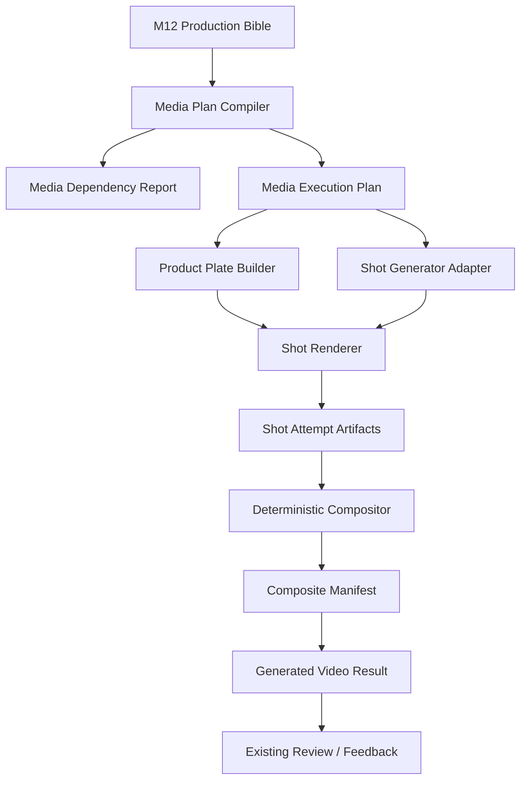

# M13 Production Bible 与可靠媒体生产设计

## 1. 状态与依据

- 日期：2026-07-16
- 分支：`product-creative-rebaseline-20260716`
- HEAD：`0aa95637213f02eca2ef8f619daaf771150a7e11`
- 当前输入：M12 已完成的 Story、Production Bible、Preflight QA 和 Skill
  provenance。
- 用户授权：已明确接受 M12 结果并允许进入下一阶段开发。
- 本设计不授权 Git commit/push/tag/release，也不默认授权真实联网或付费 Provider。

## 2. Scope Gate

分类：`IN_SCOPE`。

理由：

- `docs/MVP_SCOPE.md` 将 M13 定义为当前 MVP。
- `docs/ROADMAP.md` 将 M13 定义为唯一当前阶段。
- M13 直接补齐终局架构中的 Production Engine。
- 不增加新平台、Theme Brain、多 Agent 群、自动发布或投放分析。

## 3. Redundancy Review

结论：`EXTEND / REFACTOR_EXISTING`。

复用：

- `ProductionBibleArtifact` 和 M11/M12 专业工件链。
- `CreativeTaskRecord`、Goal Planner 和 `product_workflow_run`。
- artifact repository、workspace 文件、SQLite workflow/event/receipt/provider task。
- `GenerationProviderGateway`、provider registry、payload、异步视频任务和恢复。
- `compose_exact_main_video` 公开能力和 `exact_video_service.py`。
- Material Card/Resolver、任务授权、结果审阅和 Desktop Plugin SDK。

新增：

- 媒体依赖报告。
- 产品 plate 工件。
- 媒体执行计划。
- 镜头执行结果。
- 合成清单。
- 内部 Reliable Media Production Engine。

不新增：

- 第二套聊天入口。
- 第二套 Provider 网关。
- 第二套任务数据库。
- Product Creative 专属 Hermes core 路由。
- 平行大型编辑器。

## 4. 方案比较

### 方案 A：整条视频直接交给视频模型

优点：实现简单，模型可以产生复杂运动。

缺点：包装、中文文字、产品比例和品牌元素不可控；整条失败只能重新生成；无法可靠
解释单镜头成本和失败。

结论：保留为非保真路线，不作为 M13 包装保真主线。

### 方案 B：纯本地确定性模板

优点：包装和文字安全，成本低，恢复容易。

缺点：背景、人物、剧情和镜头表现有限，容易再次退化成“主图加通用字幕”。

结论：只作为降级路线和 compositor 基础。

### 方案 C：混合 Shot Graph

流程：

```text
Production Bible
→ 逐镜头执行计划
→ Provider 只生成背景/场景/人物或无包装产品片段
→ 不可变产品 plate 后期叠加
→ 中文字幕/品牌文字确定性渲染
→ 逐镜头编码
→ 拼接/音频混合
→ 最终视频与合成清单
```

优点：兼顾创意表现、包装保真、局部重试、成本控制和审计。

缺点：实现复杂，需要严格定义镜头角色、媒体输入和 ffmpeg 边界。

结论：采用方案 C。

## 5. 架构



### 5.1 Media Plan Compiler

把 Production Bible 编译为不可变的逐镜头计划。每个镜头包含：

- `shot_id`
- 时长和画幅
- narrative function
- 背景/人物/场景生成要求
- product plate 角色
- 字幕和音频要求
- Provider 类型
- idempotency key
- 最大尝试次数
- 成功判定

Compiler 不生成创意，不改变 Story，只负责把已批准内容变成可执行规格。

### 5.2 Dependency Report

检查：

- ffmpeg、ffprobe。
- H.264 和 AAC 编码器。
- Pillow。
- 中文字体。
- 磁盘剩余空间。
- 产品素材、尺寸和格式。
- alpha plate 或可安全抠图条件。
- Provider、凭据、reference handle 和任务授权。

报告区分：

- `READY`
- `DEGRADED`
- `BLOCKED`

### 5.3 Product Plate

包装保真路线只允许：

- 原始像素复制。
- 等比缩放。
- 平移。
- alpha mask。
- 阴影、外部光效和背景效果。

禁止：

- 重绘产品。
- 改包装文字。
- 改包装布局、比例、颜色和形状。
- 对产品主体做生成式风格化。

来源已有 alpha 时直接复用。背景接近纯色时允许确定性边缘连通抠图；不能可靠分离时
保留完整矩形产品图，或将依赖报告标记为需要人工 alpha 素材，不能假装抠图成功。

### 5.4 Shot Generator Adapter

不新建 Provider 系统。Adapter 复用现有 Provider registry/gateway：

- `image_background`：生成背景/场景静帧。
- `video_background`：生成无产品包装的短视频背景。
- `local_motion`：离线 fixture 或安全降级。

真实调用继续要求：

- task authorization。
- `PRODUCT_CREATIVE_ENABLE_REAL_PROVIDER=1`。
- Provider readiness。
- 每个镜头单独 idempotency key。

默认最大真实图片和视频调用次数均为 5，状态轮询不重复计费。

### 5.5 Shot Renderer 与 Compositor

每个镜头独立产生标准化 MP4：

- 统一分辨率、fps、像素格式和音频格式。
- 背景可来自图片、视频或 local fixture。
- 产品 plate 只在 Bible 指定镜头出现。
- 字幕和品牌文字通过 ASS/后期渲染。
- 无音频镜头补确定性静音 AAC，保证可拼接。

镜头成功后不会因其他镜头失败被删除或重新生成。

最终合成：

- concat 已完成镜头。
- 可选混合 BGM/旁白。
- 写入 faststart。
- 生成 preview。
- 保存每个输入的路径、hash、时长、编码信息和来源工件。

## 6. 工件契约

### `product_creative.media_dependency_report.v1`

保存依赖状态、检查项、blockers、warnings、工具版本和安全元数据。

### `product_creative.product_plate.v1`

保存源素材、源 hash、plate PNG、mask mode、尺寸、允许变换和禁止变换。

### `product_creative.media_execution_plan.v1`

保存 Production Bible 引用、逐镜头计划、调用预算、输出规格和重试策略。

### `product_creative.media_shot_result.v1`

每次镜头尝试一个不可变工件，保存 attempt、状态、输入/输出 hash、Provider task、
错误、是否可重试和本地标准化媒体。

### `product_creative.media_composite_manifest.v1`

保存最终镜头顺序、字幕、音频、ffmpeg 命令摘要、输出 hash、来源和完成状态。

## 7. 状态与恢复

不新增 Creative Task 状态枚举。M13 在现有 `GENERATING` 中维护细粒度媒体状态：

```text
PLAN_READY
→ DEPENDENCIES_READY
→ GENERATING_SHOTS
→ NORMALIZING_SHOTS
→ COMPOSITING
→ COMPLETED
```

失败：

- 缺依赖/素材：`BLOCKED_PRODUCT` 或 `BLOCKED_PROVIDER`
- 可重试镜头失败：`FAILED_RETRYABLE`
- 不可恢复合成失败：`FAILED_FINAL`

恢复规则：

- 从 artifact repository 读取最新成功 shot result。
- 成功镜头不重新提交。
- 失败镜头 attempt + 1。
- 达到 `max_attempts` 后停止。
- 合成可重复执行，但相同输入 hash 必须得到同一 idempotency key。

## 8. 公共入口与兼容

- 用户仍只使用 `product_workspace_resolve` 和 `product_workflow_run`。
- 不新增第二个聊天工具。
- `compose_exact_main_video` 成为可靠媒体生产兼容入口；有 Story/Bible 时进入 M13
  engine，旧无专业工件直接调用保留 legacy 行为。
- `CreativeTaskRecord.professional_artifacts` 增加 M13 工件指针，但 schema version
  保持 v1 兼容。
- 现有生成结果、review、feedback 和 recovery 继续复用。

## 9. Desktop

只扩展 plugin-owned UI：

- Tasks：媒体阶段、完成镜头数、当前失败镜头和重试次数。
- Assets：Product Plate、逐镜头输入/输出、最终视频。
- Review：Production Bible → Execution Plan → Composite Manifest provenance。
- Overview：依赖 readiness。

不增加宿主 Product Creative 专属代码。

## 10. 测试

### 单元

- Bible → plan 编译。
- 路线和素材角色。
- plate 像素保真与 mask。
- dependency report。
- subtitle/concat 文件生成。
- idempotency 和重试判定。

### 集成

- 五镜头 fixture 背景 → plate → 字幕 → 标准化 → concat。
- 中间一个镜头失败，只重试该镜头。
- 重启后复用已完成镜头。
- workspace 切换不串路径。
- 包装 hash 与源像素一致。

### 自然语言 E2E

输入：

> 使用当前主图，包装和文字不能改变，按照已选创意生成一条竖版产品视频。

验收：

- Hermes 通过同一公开任务进入 M13。
- 生成依赖报告、plate、执行计划、五个 shot result 和 composite manifest。
- 无 Provider 授权时停在授权边界。
- fixture 授权模式产生真实可播放本地 MP4。
- 失败后自然语言“继续这个视频”只恢复未完成镜头。

### Live

只有用户再次确认后：

- 使用最多 5 次真实返回。
- 先做最小镜头/背景生成。
- 轮询等待真实异步结果。
- 最终本地合成。
- 不写 Product Brain。

## 11. 完成条件

M13 只有在以下全部成立时标记 DONE：

- Production Bible 可编译为逐镜头计划。
- 产品 plate 保留包装像素边界。
- 字幕和品牌文字不由生成模型绘制。
- fixture 路线生成真实可播放 MP4，而不是空 mock descriptor。
- 单镜头失败可恢复且不重复成功镜头。
- ffmpeg/字体/磁盘/Provider readiness 可诊断。
- 自然语言离线 E2E 完整通过。
- M0–M12、Desktop、public surface 和分发回归通过。
- 真实 Provider 验收要么在用户授权下完成，要么明确保持为独立 Live Gate，不能用
  mock 冒充。

## 12. 非目标

- 生成后包装/人物/剧情自动视觉 QA 和自动返修属于 M14。
- 自动发布、矩阵生产和投放分析不进入 M13。
- 不拆仓、不升级依赖、不提交、不推送。
