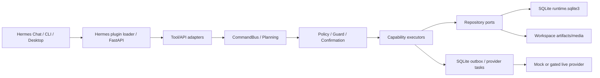

# Architecture Recovery

## 当前实际架构

**CONFIRMED**：Hermes 宿主 + Product Creative Python 模块化单体 + 本地 SQLite/文件存储 + Electron Desktop。Product Creative 位于 `.hermes/plugins/product_creative/`，不应继续向 Hermes core 添加产品专属业务逻辑。

## 模块职责与调用链

- `capabilities/`：product/material/inspiration/content/image/video/review/learning/recovery。
- `capabilities/registry.py`：能力、命令、策略、workflow fragment 中央注册。
- `application/command_bus.py`：统一命令、确认、policy、receipt、错误。
- `runtime/` + `durable_workflow/`：意图、计划、状态机、执行、trace。
- `ports/` + `infrastructure/composition.py`：仓储/provider 抽象与 SQLite/filesystem 绑定。
- `dashboard/plugin_api.py`：`/api/plugins/product_creative/v1` 查询和恢复 API。
- `provider_*` + outbox：payload/readiness/HTTP/task/result。

主链：manifest tool → capability registry → `CommandBus` → guard/policy → executor → repository/provider → event/receipt/artifact。

## HEAD 与工作区

- **HEAD M9**：Product Creative React 页面硬编码在 Hermes Desktop。
- **WORKTREE M9.1**：删除专属页面，增加通用 Desktop Plugin SDK、authenticated bundle API 和插件自带 bundle。
- **PARTIAL**：`/api/desktop/plugins` 排除 project plugin；本地开发副本需导出/安装为 user plugin 才能进入动态 Desktop 列表。

## 高耦合/重复风险

- `capabilities/registry.py` 是中央聚合点。
- `tools.py` 经 CommandBus，而 `tool_handlers.py` 存在直接 handler 表面，需避免绕过 durable policy/receipt。
- 新旧 provider/workflow/store facade 并存；部分是兼容层，但命名易误导。
- M9.1 插件 UI 重新实现按钮、tabs、dialog，与宿主 UI 组件重复。

## 未接通/占位

- 真实 provider 默认关闭，部分 registry 为 `mock_only`。
- mock image 会生成明确占位结果。
- provider payload 可含 `<public-url-for-...>` 占位。
- `AgentRuntimeController` 未发现稳定入口引用。
- 工作区的 M9.1 新文件尚未跟踪。

## 文档冲突

旧 runtime architecture 仍以 JSON/JSONL 为主要 durable state；当前代码以 SQLite 为运行真源、文件为媒体/可审阅 artifact/兼容输出。Roadmap/M4 Desktop 文档也落后于 M9/M9.1。
